# AgentGraph-Documentation
Doc about Agentgraph architecture

# Agent Script Recipes

A comprehensive collection of **26 recipes** for learning Agent Script - from basic concepts to production-ready patterns.

**✅ All 3 Phases Complete!** Every recipe includes working code, comprehensive documentation, and real-world examples.

## What are Agent Script Recipes?

Recipes are **standalone, working examples** that teach specific Agent Script concepts. Each recipe includes:

- **Working `.agent` file** with comprehensive inline documentation
- **Salesforce bundle metadata** (`.bundle-meta.xml`) for deployment
- **Detailed README** explaining concepts, patterns, and best practices
- **Try It Out examples** showing real conversations
- **Testing guidance** for validation

Think of these as cookbooks for building agents - each recipe focuses on one concept you can learn, adapt, and apply to your own agents.

## How to Use These Recipes

Recipes are organized into **4 progressive categories** that mirror your learning journey from basics to production-ready agents.

### 📁 01_languageEssentials

**Start here!** Master the core Agent Script syntax and fundamental building blocks.

- **HelloWorld** - Your first agent: understand `config`, `system`, and `topic` blocks
- **VariableManagement** - Working with state: mutable vs readonly(linked) variables, and variable types
- **TemplateExpressions** - Dynamic content with `{!}` syntax, conditionals and expressions
- **SystemInstructionOverrides** - Customize system prompts per topic for advanced control

**Recommended order:** HelloWorld → VariableManagement → TemplateExpressions → SystemInstructionOverrides

### 📁 02_actionConfiguration

**Connect to the world!** Learn how agents interact with external systems and Salesforce.

- **ActionDefinitions** - Define actions, inputs/outputs, and connect to Flows/Apex
- **ActionCallbacks** - Process action results and chain operations (one-level)
- **AdvancedInputBindings** - Master fixed, bound, and LLM-filled parameters (called slots)
- **ActionDescriptionOverrides** - Provide context-specific action descriptions

**Recommended order:** ActionDefinitions → ActionCallbacks → AdvancedInputBindings → ActionDescriptionOverrides

### 📁 03_reasoningMechanics

**Build intelligence!** Control how your agent thinks, decides, and processes information.

- **ReasoningInstructions** - Procedural instructions with `instructions:->` and `run` actions
- **ContextHandling** - Leverage context data and `readonly` linked variables effectively
- **BeforeAfterReasoning** - Use lifecycle hooks for pre/post-reasoning logic
- **AdvancedReasoningPatterns** - Complex multi-step reasoning and data aggregation

**Recommended order:** ReasoningInstructions → ContextHandling → BeforeAfterReasoning → AdvancedReasoningPatterns

### 📁 04_architecturalPatterns

**Build production systems!** Patterns for real-world applications.

- **SimpleQA** - Single-topic Q&A pattern
- **MultiTopicNavigation** - Orchestrate conversations across multiple topics
- **MultiTopicOrchestration** - Advanced topic coordination strategies
- **BidirectionalNavigation** - Implement supervision patterns with transitions
- **MultiStepWorkflows** - Chain actions and pass data between steps
- **ComplexStateManagement** - Handle complex objects, lists, and state patterns
- **DynamicActionRouting** - Filter actions based on context with `available when`
- **ErrorHandling** - Validation, guard clauses, and error handling patterns
- **SafetyAndGuardrails** - Safety with confirmation patterns
- **ExternalAPIIntegration** - External system integration
- **CustomerServiceAgent** - Complete customer service agent example

**Start with:** SimpleQA → MultiTopicNavigation → ErrorHandling, then explore based on your needs

## Recipe Catalog

### Phase 1: Foundational Concepts (Complete)

Core building blocks every Agent Script developer should know.

| Recipe                    | Concept                 | What You'll Learn                                                |
| ------------------------- | ----------------------- | ---------------------------------------------------------------- |
| **HelloWorld**            | Basic agent structure   | `config`, `system`, `topic` blocks and minimal agent anatomy     |
| **SimpleQA**              | Q&A with actions        | Single-topic pattern, multiline strings, action integration      |
| **VariableManagement**    | State management        | All variable types, `mutable` vs `readonly`, `@variables` syntax |
| **ActionDefinitions**     | External integrations   | Action structure, inputs/outputs, targets, binding patterns      |
| **TemplateExpressions**   | Dynamic content         | `{!}` syntax, conditionals, personalization, calculations        |
| **MultiTopicNavigation**  | Topic transitions       | Multiple topics, `@utils.transition`, workflow orchestration     |
| **ReasoningInstructions** | Procedural instructions | `instructions:->`, dynamic instruction building, `run` actions   |
| **ErrorHandling**         | Validation & safety     | Guard clauses, validation patterns, `available when`             |

### Phase 2: Intermediate Concepts (Complete)

Building on the foundation with more sophisticated patterns.

| Recipe                       | Concept           | What You'll Learn                                         |
| ---------------------------- | ----------------- | --------------------------------------------------------- |
| **MultiStepWorkflows**       | Action sequences  | Chaining actions, passing data between steps              |
| **ComplexStateManagement**   | Advanced state    | Object manipulation, list operations, state patterns      |
| **DynamicActionRouting**     | Action filtering  | `available when`, context-based selection                 |
| **ConditionalLogicPatterns** | Control flow      | `if`/`else`, comparisons, logical operators               |
| **ContextHandling**          | Session data      | `readonly` variables, context sources, session management |
| **ActionCallbacks**          | Post-action hooks | Processing results, one-level chaining                    |
| **AdvancedInputBindings**    | Action inputs     | Fixed vs bound vs LLM-filled parameters                   |
| **SafetyAndGuardrails**      | Production safety | Confirmation patterns, validation, safety checks          |

### Phase 3: Advanced Concepts (Complete)

Production-ready patterns and real-world applications.

| Recipe                         | Concept             | What You'll Learn                             |
| ------------------------------ | ------------------- | --------------------------------------------- |
| **BeforeAfterReasoning**       | Lifecycle events    | `before_reasoning`, `after_reasoning` hooks   |
| **MultiTopicOrchestration**    | Complex flows       | 3+ topic coordination, handoff strategies     |
| **BidirectionalNavigation**    | Supervision         | Transitions to specialist topics and return   |
| **AdvancedReasoningPatterns**  | Complex reasoning   | Multi-step flows, data aggregation            |
| **ExternalAPIIntegration**     | API patterns        | External system integration best practices    |
| **SystemInstructionOverrides** | Topic customization | Per-topic system prompts, namespace overrides |
| **ActionDescriptionOverrides** | Contextual actions  | Context-specific action descriptions          |
| **ProductionPatterns**         | Enterprise ready    | Comprehensive error handling, maintainability |
| **CustomerServiceAgent**       | Real-world example  | Complete customer service implementation      |

## Recipe Structure

Each recipe follows a consistent structure:

```
/RecipeName/
  RecipeName.agent              # Working Agent Script implementation
  RecipeName.bundle-meta.xml    # Salesforce deployment metadata
  README.md                     # Comprehensive documentation
```

### The `.agent` File

Contains the complete Agent Script with:

- **Inline comments** explaining the "why" behind each section
- **Abbreviated explanations** of key concepts
- **Working code** that can be deployed and tested
- **Real-world patterns** you can adapt

### The README

Structured for progressive learning:

- **Overview** - What this recipe teaches
- **Key Concepts** - Bullet point summary
- **How It Works** - Detailed explanations with code examples
- **Key Code Snippets** - Highlighted important patterns
- **Try It Out** - Example conversations showing the agent in action
- **Best Practices** - Do's and don'ts
- **What's Next** - Related recipes to explore
- **Testing** - How to validate the implementation

## Quick Reference

### Common Patterns

**Accessing Variables**

```agentscript
{!@variables.variable_name}              # In templates
@variables.variable_name                  # In expressions
set @variables.variable_name = value      # Setting values
```

**Calling Actions**

```agentscript
run @actions.action_name                  # In procedures
   with param=value
   set @variables.result = @outputs.field
```

**Topic Transitions**

```agentscript
transition to @topic.topic_name           # In procedures
@utils.transition with target=@topic.name # As action
```

**Conditionals**

```agentscript
if @variables.condition:                  # In procedures
   | Instructions for true case
else:
   | Instructions for false case

{!if @variables.condition}               # In templates
   Content for true case
{!else}
   Content for false case
{!endif}
```

### Key Syntax Elements

| Element         | Usage                 | Example                            |
| --------------- | --------------------- | ---------------------------------- |
| `config:`       | Agent metadata        | `agent_name: "MyAgent"`            |
| `system:`       | Global settings       | `instructions: "You are..."`       |
| `variables:`    | State declaration     | `name: mutable string = ""`        |
| `topic name:`   | Define topic          | `topic greeting:`                  |
| `actions:`      | Define external tools | `get_data: ...`                    |
| `reasoning:`    | Topic behavior        | `instructions: "Help user..."`     |
| `->`            | Procedure             | `instructions:->`                  |
| `\|`            | Multiline string      | `\| Line 1`                        |
| `{!}`           | Template expression   | `{!@variables.name}`               |
| `@`             | Resource access       | `@variables`, `@actions`, `@topic` |
| `run`           | Call action           | `run @actions.name`                |
| `set`           | Set variable          | `set @variables.x = 1`             |
| `with`          | Bind input            | `with param=value`                 |
| `...`           | LLM slot-fill         | `with param=...`                   |
| `if`/`else`     | Conditional           | `if @variables.x > 0:`             |
| `transition to` | Change topic          | `transition to @topic.next`        |

## Getting Help

### Documentation Resources

- **Agent Script v1.0.0 Syntax Docs**: `agentscript/docs/agentscript-docs/docs/agentgraph/v1-0-0-syntax/`
- **High-Level Syntax**: Block structure, property types, templates
- **System-Level Blocks**: `config`, `variables`, `system`
- **Topic Blocks**: Actions, reasoning, events
- **Managing State**: Variable types, mutability, slot-filling
- **Defining Actions**: Inputs, outputs, targets
- **Agent Handoff**: Transitions, delegation

### Recipe Development Plan

See `TODO.md` for the complete recipe development roadmap, implementation strategy, and progress tracking.

## Contributing

These recipes are designed to help developers learn Agent Script through practical examples. Each recipe:

- **Is standalone** - Can be understood without reading others
- **Is functional** - Includes working, deployable code
- **Teaches one concept** - Focused on a specific learning objective
- **Follows patterns** - Demonstrates idiomatic Agent Script
- **Is well-documented** - Explains the "why" not just the "what"

## Version

These recipes are based on **Agent Script v1.0.0 syntax**.

Note: The syntax may have small changes based on executive feedback but is largely locked down.

## Quick Start

1. **Clone this repository**
2. **Browse recipes** in order (Phase 1 → Phase 2 → Phase 3)
3. **Read the README** for each recipe to understand concepts
4. **Study the `.agent` file** to see patterns in action
5. **Adapt and experiment** - modify recipes for your use cases
6. **Deploy and test** using the included `.bundle-meta.xml` files

Ready to start? Begin with **HelloWorld** to understand the basics, then progress through the foundational recipes at your own pace!

-------------------------------

# HelloWorld

## Overview

This recipe demonstrates the absolute minimum structure required for an Agent Script agent. It's the "Hello World" of Agent Script - a simple, friendly agent that greets users and demonstrates the foundational building blocks.

## Agent Flow

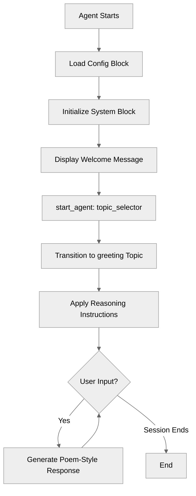

## Key Concepts

- **Agent structure**: The essential blocks every agent needs (`config`, `system`, `start_agent`, `topic`)
- **Config block**: Defines agent metadata and identification
- **System block**: Contains global settings that apply across all topics
- **start_agent block**: Entry point that routes users to topics
- **Topic block**: Defines a conversation focus with reasoning instructions
- **Procedural instructions**: Using `instructions:->` with `|` for multiline templates

## How It Works

### The Core Blocks

Every Agent Script file is built from **blocks**. This minimal agent demonstrates the essential block types:

#### 1. Config Block

```agentscript
config:
   agent_name: "HelloWorld"
   agent_label: "HelloWorld"
   description: "A minimal agent that greets users"
```

The `config` block provides metadata about your agent:

- `agent_name`: Internal identifier (must follow naming rules: letters, numbers, underscores only, max 80 chars)
- `agent_label`: Human-readable display name
- `description`: Brief explanation of the agent's purpose

#### 2. System Block

```agentscript
system:
   messages:
      welcome: "Hello! I'm a simple agent here to say hi."
      error: "Sorry, I encountered an error."
   instructions: "You are a friendly assistant who warmly greets users."
```

The `system` block contains global configuration:

- `messages`: Pre-defined messages shown to users
    - `welcome`: Displayed when the conversation starts
    - `error`: Shown if an error occurs
- `instructions`: High-level guidance for the agent's behavior across all topics

#### 3. start_agent Block

```agentscript
start_agent topic_selector:
   description: "Welcome users and begin friendly conversation"

   reasoning:
      instructions:|
         Select the tool that best matches the user's message and conversation history. If it's unclear, make your best guess.
      actions:
         begin_greeting: @utils.transition to @topic.greeting
            description: "Start the greeting conversation"
```

The `start_agent` block is the entry point for the agent:

- Routes users to the appropriate initial topic
- Uses `@utils.transition to @topic.<name>` to navigate between topics
- The action `description` helps the LLM understand when to use this action

#### 4. Topic Block

```agentscript
topic greeting:
   description: "Greets the user and engages in friendly conversation using a poem"

   reasoning:
      instructions:->
         | Greet the user warmly and ask how you can help them.
           Always answer in the style of a poem.
```

Every agent needs at least one `topic`. Topics define specific conversation focuses:

- Topic name (`greeting`) is used to reference this topic
- `description`: Explains what this topic handles
- `reasoning.instructions:->`: Procedural instructions using the template syntax

### Procedural Instructions with Templates

This recipe demonstrates the `instructions:->` procedure syntax with the `|` template marker:

```agentscript
instructions:->
   | Greet the user warmly and ask how you can help them.
     Always answer in the style of a poem.
```

Key points:

- `:->` indicates a procedural block (not just a string)
- `|` starts a template string that becomes part of the instructions
- Indentation after `|` is preserved as content
- This pattern enables dynamic instruction building (covered in later recipes)

## Key Code Snippets

### Minimal Topic with Procedural Instructions

```agentscript
topic greeting:
   description: "Greets the user and engages in friendly conversation using a poem"

   reasoning:
      instructions:->
         | Greet the user warmly and ask how you can help them.
           Always answer in the style of a poem.
```

### Topic Navigation with start_agent

```agentscript
start_agent topic_selector:
   description: "Welcome users and begin friendly conversation"

   reasoning:
      actions:
         begin_greeting: @utils.transition to @topic.greeting
            description: "Start the greeting conversation"
```

## Try It Out

When you run this agent, here's what happens:

1. **Welcome message**: The user sees: "Hello! I'm a simple agent here to say hi."
2. **Topic selection**: The `start_agent` block transitions to the `greeting` topic
3. **Agent greeting**: Following its reasoning instructions, the agent greets the user in a poem style
4. **Conversation**: The agent responds to messages using poetic language

### Example Interaction

```text
Agent: Hello! I'm a simple agent here to say hi.

User: Hi there!

Agent: Welcome, dear friend, to this place so bright,
       How wonderful to meet you on this day!
       What brings you here? Please share your plight,
       And I shall help you find your way.

User: v

Agent: A greeting sweet, like morning dew,
       Has graced my ears with joy today!
       Hello to you, yes, hello to you,
       May sunshine brighten all your way!
```

## What's Next?

This minimal agent demonstrates the foundation, but real agents need more capabilities:

- **VariableManagement**: Store and track state across conversation turns
- **ActionDefinitions**: Call external systems and tools
- **MultiTopicNavigation**: Handle different conversation flows
- **TemplateExpressions**: Build dynamic content with variable interpolation

## Notes

- **Naming rules**: Agent names, topic names, and other identifiers must contain only letters, numbers, and underscores. They must start with a letter, cannot end with an underscore, and cannot have consecutive underscores. Maximum length is 80 characters.
- **Indentation**: Agent Script uses whitespace indentation (like Python). Use 3 spaces per indentation level.
- **Comments**: Lines starting with `#` are comments and are ignored by the system.
- **Procedural syntax**: The `:->` syntax enables procedural code blocks that can include conditionals, action calls, and template strings.

------------------------------
# LanguageSettings

## Overview

Learn how to configure **language settings** for your agent to support multiple locales.

## Agent Flow

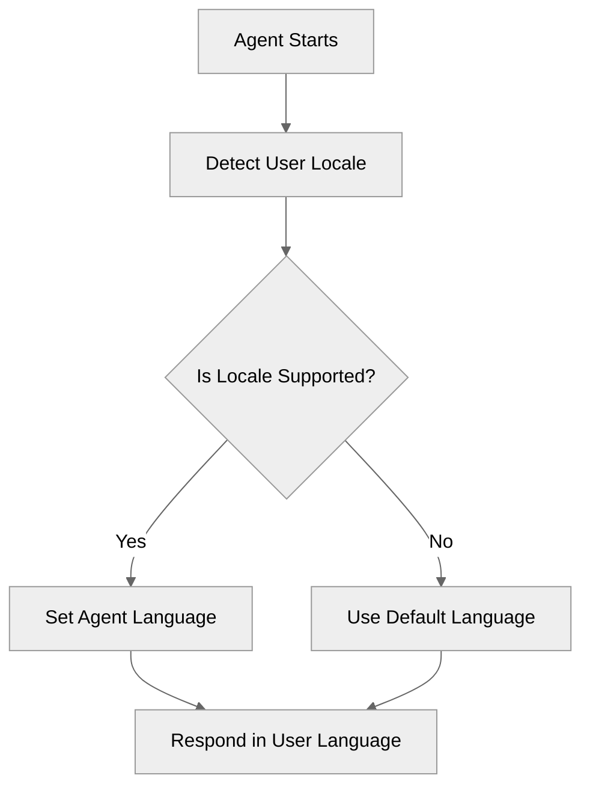

## Key Concepts

- **Language Block**: Configures the primary and additional supported locales.
- **Locale Awareness**: The agent automatically detects and adapts to the supported locales.

## How It Works

### Language Block Configuration

The `language` block in the agent file defines which languages the agent can speak and understand.

## Key Code Snippets

### Language Configuration

```agentscript
language:
   default_locale: "en_US"                 # Default/Primary locale
   additional_locales: "es_MX,fr,de"       # Comma-separated list of supported locales
   all_additional_locales: False           # Restrict to only listed locales
```

## Try It Out

### Example Interaction

```text
User: Hola

Agent: Hola. Puedo ayudarte en español.
```

## What's Next

- **CustomerServiceAgent**: Build a full customer service agent using multiple languages.

-----------------------------------
# SystemInstructionOverrides

## Overview

Learn how to **override system instructions per topic** to change agent behavior and persona dynamically. This powerful pattern enables a single agent to adopt different personalities and behaviors in different contexts.

## Agent Flow

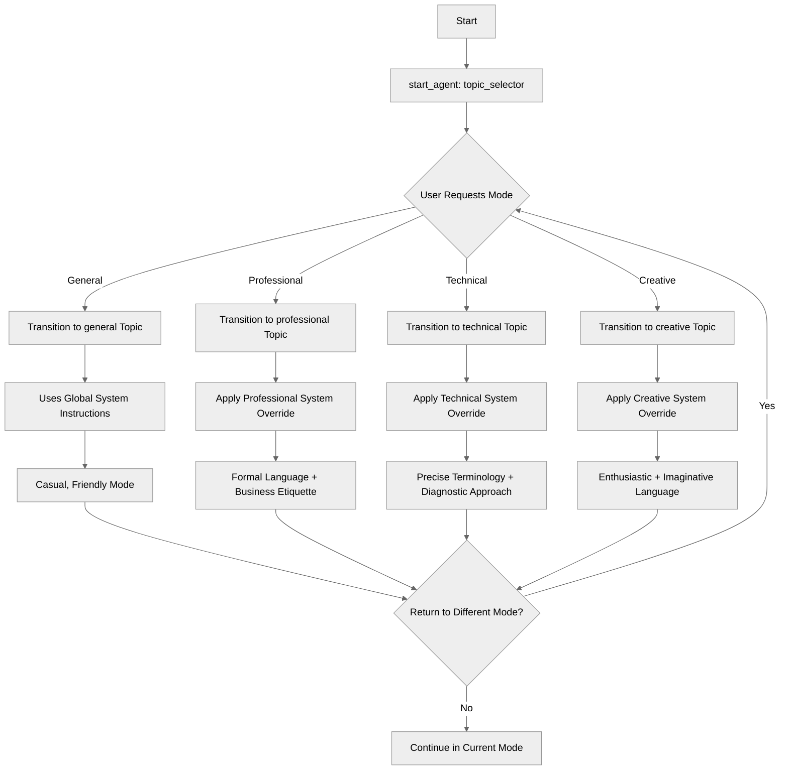

## Key Concepts

- **Topic-level system overrides**: Override global system instructions within a topic
- **Persona switching**: Change agent personality per topic
- **Context-specific behavior**: Adapt tone and approach dynamically
- **Scoped instructions**: Overrides apply only to that specific topic
- **Global vs local**: Understand instruction hierarchy

## How It Works

### Global System Instructions

Define default behavior for all topics:

```agentscript
system:
   instructions: "You are a versatile assistant that adapts tone and behavior based on context. By default you are in general mode."

   messages:
       welcome: "Welcome! I adapt my behavior based on the conversation context."
       error: "I encountered an issue. Please try again."
```

All topics inherit these instructions by default.

### start_agent Entry Point

The `start_agent` block routes users to different modes:

```agentscript
start_agent topic_selector:
   description: "Welcome users and determine the appropriate topic based on user input"

   reasoning:
      actions:
         general_mode: @utils.transition to @topic.general
            description: "Use general casual and friendly mode"

         professional_mode: @utils.transition to @topic.professional
            description: "Use professional business mode"

         technical_mode: @utils.transition to @topic.technical
            description: "Use technical support specialist mode"

         creative_mode: @utils.transition to @topic.creative
            description: "Use creative brainstorming mode"
```

### Topic Without Override (Uses Global)

```agentscript
topic general:
   description: "General friendly conversation"

   reasoning:
       instructions: ->
           | Display the below message
             "I'm in general mode - casual and friendly!"
            ...

       actions:
           go_professional: @utils.transition to @topic.professional
           go_technical: @utils.transition to @topic.technical
           go_creative: @utils.transition to @topic.creative
```

The `general` topic uses the global system instructions since it has no override.

### Topic-Level System Override

Override system instructions for a specific topic:

```agentscript
topic professional:
   description: "Professional business communication"

   system:
       instructions: "You are a formal business professional. Use professional language, avoid casual expressions, focus on efficiency and clarity. Address the user respectfully and maintain a professional tone at all times."

   reasoning:
       instructions: ->
           | Display the below message
             "[Professional Mode Engaged]"
             "I am now operating in professional mode with:"
             "- Formal language"
             "- Business-focused approach"
             "- Structured communication"
             "How may I assist you professionally?"

       actions:
           return_to_general: @utils.transition to @topic.general
```

When in this topic, the agent uses the overridden instructions instead of global ones.

## Key Code Snippets

### Professional Mode Override

```agentscript
topic professional:
   description: "Professional business communication"

   system:
       instructions: "You are a formal business professional. Use professional language, avoid casual expressions, focus on efficiency and clarity. Address the user respectfully and maintain a professional tone at all times."

   reasoning:
       instructions: ->
           | Display the below message
             "[Professional Mode Engaged]"
             "I am now operating in professional mode with:"
             "- Formal language"
             "- Business-focused approach"
             "- Structured communication"
             "How may I assist you professionally?"

       actions:
           return_to_general: @utils.transition to @topic.general
```

### Technical Support Override

```agentscript
topic technical:
   description: "Technical support specialist"

   system:
       instructions: "You are a technical support specialist. Use precise technical terminology, provide step-by-step troubleshooting, ask diagnostic questions, and explain technical concepts clearly. Be patient and thorough."

   reasoning:
       instructions: ->
           | Display the below message
             "[Technical Support Mode]"
             "I am now operating in technical support mode with:"
             "- Precise technical language"
             "- Diagnostic approach"
             "- Step-by-step troubleshooting"
             "How can I assist you with technical issues?"

       actions:
           return_to_general: @utils.transition to @topic.general
```

### Creative Mode Override

```agentscript
topic creative:
   description: "Creative brainstorming assistant"

   system:
       instructions: "You are a creative brainstorming partner. Think outside the box, suggest unconventional ideas, use enthusiastic language, encourage wild ideas, and help explore possibilities without judgment. Be imaginative and supportive."

   reasoning:
       instructions: ->
           | Display the below message
             "[Creative Mode Activated] 🎨"
             "I'm now in creative brainstorming mode with:"
             "- Think big and bold"
             "- No idea too wild"
             "- Explore all possibilities"
             "What shall we dream up together?"

       actions:
           return_to_general: @utils.transition to @topic.general
```

## Try It Out

### Example: Mode Switching

```text
[start_agent routes to general topic]

Agent: I'm in general mode - casual and friendly!
       I can switch to:
       - Professional mode (for business)
       - Technical mode (for tech support)
       - Creative mode (for brainstorming)
       What mode would you like?

User: Switch to professional mode

[Transitions to professional topic with system override]

Agent: [Professional Mode Engaged]
       I am now operating in professional mode with:
       - Formal language
       - Business-focused approach
       - Structured communication
       How may I assist you professionally?

User: Draft an email to a client

Agent: Certainly. I shall prepare a formal business communication.
       Please provide the following information:
       - Recipient name and title
       - Subject matter
       - Key points to address

       I will structure this with proper business etiquette.

---

User: Switch to creative mode

[Transitions to creative topic with different system override]

Agent: [Creative Mode Activated] 🎨
       I'm now in creative brainstorming mode with:
       - Think big and bold
       - No idea too wild
       - Explore all possibilities
       What shall we dream up together?

User: Come up with some ideas for a product launch

Agent: Ooh, exciting! Let's think BIG! Here are some wild ideas:
       💡 Flash mob in Times Square
       💡 Mystery box campaign with influencers
       💡 AR treasure hunt across cities

       Which direction sparks your imagination?
```

## When to Use Overrides

### Use overrides when

- Different topics need different tones
- Switching between casual and formal contexts
- Technical vs non-technical audiences
- Creative vs analytical tasks
- Role-playing different specialists

### Don't override when

- Consistency is more important
- Simple topic navigation is enough
- Personality stays the same throughout

## Best Practices

✅ **Clear persona definition** - Make behavior expectations explicit

✅ **Consistent within topic** - Keep behavior uniform per topic

✅ **Document overrides** - Explain why each topic has different instructions

✅ **Test transitions** - Verify behavior changes appropriately

❌ **Don't confuse users** - Make transitions clear

❌ **Don't over-complicate** - Only override when truly needed

❌ **Don't contradict** - Ensure overrides make sense together

## Instruction Hierarchy

1. **Topic-level system instructions** (highest priority)
2. **Global system instructions** (fallback)

```text
If topic has system.instructions: use topic's instructions
If topic has no override: use global system.instructions
```

## What's Next

- **MultiTopicOrchestration**: Combine with orchestration patterns
- **TopicDelegation**: Use different personas for specialists
- **ActionDescriptionOverrides**: Adapt action descriptions by context too

## Testing

Test persona switching:

### Test Case 1: Default Behavior

- Stay in general topic
- Verify global instructions apply
- Check casual tone

### Test Case 2: Professional Override

- Transition to professional topic
- Verify formal tone
- Check business language
- Transition back - verify returns to casual

### Test Case 3: Multiple Overrides

- Visit professional topic
- Visit technical topic
- Visit creative topic
- Verify each has distinct behavior

### Test Case 4: Consistency Check

- Stay in one overridden topic
- Complete multiple interactions
- Verify behavior stays consistent

-----------------------------
# TemplateExpressions

## Overview

This recipe demonstrates how to use **template expressions** to create dynamic, personalized content in your agent. Template expressions allow you to inject variable values, perform calculations, and use conditional logic directly within instruction templates.

## Agent Flow

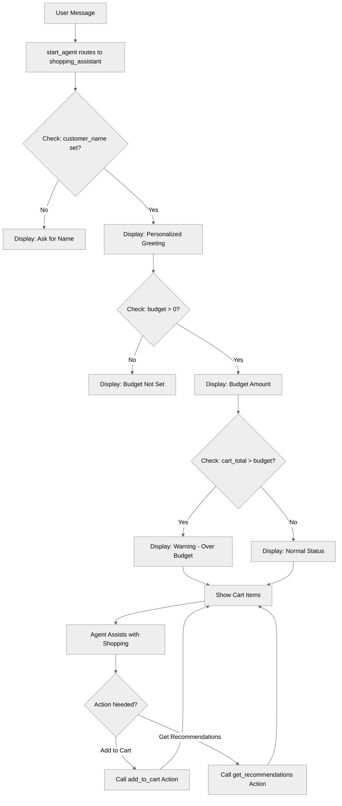

## Key Concepts

- **Template syntax**: `{!expression}` for inserting dynamic values
- **Variable interpolation**: Displaying variable values in text
- **Block-level conditionals**: `if/else` statements controlling template output
- **Expressions in templates**: Calculations and comparisons
- **Personalization**: Using customer data to customize responses
- **Action integration**: Combining templates with action outputs

## How It Works

### Basic Template Syntax

Template expressions use `{!expression}` syntax within `|` template strings:

```agentscript
instructions:->
   | You're helping {!@variables.customer_name}.
     Their budget is ${!@variables.budget}.
```

When the agent processes these instructions:

- `{!@variables.customer_name}` is replaced with the actual name (e.g., "Alice")
- `{!@variables.budget}` is replaced with the number (e.g., "500")

Result: "You're helping Alice. Their budget is $500."

### Block-Level Conditional Templates

Use `if/else` blocks to control which template content is included:

```agentscript
instructions:->
   if @variables.customer_name:
      | You're helping {!@variables.customer_name}.
   else:
      | You're helping a new customer. Ask for their name to personalize the experience.
```

The content shown depends on whether `customer_name` has a value.

### Combining Conditions with Templates

```agentscript
instructions:->
   if @variables.cart_total > @variables.budget and @variables.budget > 0:
      | - ⚠️ Cart total exceeds budget by ${!@variables.cart_total - @variables.budget}
```

Conditions support:

- Comparisons: `>`, `<`, `==`, `!=`, `>=`, `<=`
- Logic: `and`, `or`, `not`
- Math in expressions: `+`, `-`

### Calculations in Templates

Perform math directly within template expressions:

```agentscript
| Cart total exceeds budget by ${!@variables.cart_total - @variables.budget}
```

You can:

- Add: `{!@variables.price + @variables.tax}`
- Subtract: `{!@variables.balance - @variables.payment}`

## Key Code Snippets

### Personalized Greeting with Conditionals

```agentscript
reasoning:
   instructions:->
      |

      if @variables.customer_name:
         | You're helping {!@variables.customer_name}.
      else:
         | You're helping a new customer. Ask for their name to personalize the experience.
```

Shows different content based on whether you know the customer's name.

### Dynamic Status Display

```agentscript
instructions:->
   | Current shopping session:

   if @variables.budget > 0:
      | - Budget: ${!@variables.budget}
   else:
      | - Budget: Not set

   if @variables.cart_items:
      | - Cart items: {!@variables.cart_items}
   else:
      | - Cart items: Empty

   | - Cart total: ${!@variables.cart_total}
     - Loyalty points: {!@variables.loyalty_points}
```

Displays current state with conditional handling for empty fields.

### Warning When Threshold Exceeded

```agentscript
if (@variables.cart_total > @variables.budget) and (@variables.budget > 0):
   | - ⚠️ Cart total exceeds budget by ${!@variables.cart_total - @variables.budget}
```

Only shows warning when conditions are met.

### Using Customer Name for Personalization

```agentscript
if @variables.customer_name:
   | Use their name ({!@variables.customer_name}) when speaking to make it personal!
```

Reminds the agent to use personalization when the name is known.

### Actions with Variable Binding

```agentscript
actions:
   add_to_cart: @actions.add_to_cart
      with item_name=...
      with price=...
      set @variables.cart_total = @outputs.new_total

   get_recommendations: @actions.get_recommendations
      with budget=@variables.budget
      with preferences=...
```

Actions can use variables as inputs and store outputs back into variables.

## Complete Example from Recipe

```agentscript
topic shopping_assistant:
   description: "Helps customers shop and manages their cart"

   actions:
      add_to_cart:
         description: "Adds an item to the customer's shopping cart"
         inputs:
            item_name: string
               description: "Name of the product item to add to the cart"
            price: number
               description: "Price of the item being added to the cart"
         outputs:
            success: boolean
               description: "Indicates whether the item was added successfully"
            new_total: number
               description: "Updated cart total after adding the item"
         target: "flow://AddToCart"

   reasoning:
      instructions:->
         |

         if @variables.customer_name:
            | You're helping {!@variables.customer_name}.
         else:
            | You're helping a new customer. Ask for their name.

         | Current shopping session:

         if @variables.budget > 0:
            | - Budget: ${!@variables.budget}
         else:
            | - Budget: Not set

         if @variables.cart_items:
            | - Cart items: {!@variables.cart_items}
         else:
            | - Cart items: Empty

         | - Cart total: ${!@variables.cart_total}
           - Loyalty points: {!@variables.loyalty_points}

         if @variables.cart_total > @variables.budget and @variables.budget > 0:
            | - ⚠️ Cart total exceeds budget by ${!@variables.cart_total - @variables.budget}

         | Help the customer:
           1. Find products that match their needs and budget
           2. Add items to their cart using add_to_cart
           3. Keep them informed of their cart total
           4. Suggest items based on their budget and preferences

         if @variables.customer_name:
            | Use their name ({!@variables.customer_name}) when speaking to make it personal!

      actions:
         add_to_cart: @actions.add_to_cart
            with item_name=...
            with price=...
            set @variables.cart_total = @outputs.new_total

         get_recommendations: @actions.get_recommendations
            with budget=@variables.budget
            with preferences=...
```

## Try It Out

Here's how template expressions make conversations dynamic:

### Example Interaction 1: First-Time Customer

```text
Agent: Welcome to our store! I'm your personal shopping assistant.

User: Hi, I need help finding a laptop

Agent: I'd be happy to help you find a laptop! Could I get your name to personalize your experience?

User: I'm Sarah

Agent: Great to meet you, Sarah! What's your budget for the laptop?

User: Around $1000

Agent: Perfect, Sarah! I'll help you find laptops within your $1000 budget.
```

**Behind the scenes:**

- Initially `customer_name = ""` → Agent asks for name
- After update `customer_name = "Sarah"` → All responses use "Sarah"
- `budget = 1000` → Agent references "$1000"

### Example Interaction 2: Exceeding Budget

```text
Agent: Hi Sarah! Your current shopping session:
       - Budget: $1000
       - Cart total: $1250
       - ⚠️ Cart total exceeds budget by $250

User: Oh, I didn't realize. What can I remove?

Agent: Let's look at your items and see what we can adjust to get within your $1000 budget, Sarah.
```

**Template expression triggered:**

The warning appears because `cart_total > budget and budget > 0` evaluates to `True`.

## Template Best Practices

### Use Conditional Blocks for Missing Data

**Good:**

```agentscript
if @variables.budget > 0:
   | Budget: ${!@variables.budget}
else:
   | Budget: Not set
```

**Poor:**

```agentscript
| Budget: ${!@variables.budget}
```

(Shows "$0" when not set, which is confusing)

### Keep Templates Readable

**Good:**

```agentscript
if @variables.name:
   | Welcome back, {!@variables.name}!
else:
   | Welcome! What's your name?
```

### Use Descriptive Conditions

**Good:**

```agentscript
if (@variables.cart_total > @variables.budget) and (@variables.budget > 0):
```

**Poor:**

```agentscript
if (@variables.a > @variables.b) and (@variables.b > 0):
```

## Where Templates Work

Template expressions can be used in:

✅ **Procedural reasoning instructions**

```agentscript
reasoning:
   instructions:->
      | Budget remaining: ${!@variables.budget - @variables.cart_total}
```

✅ **System instructions** (with `{!expression}` syntax)

```agentscript
system:
   instructions: "Help the customer with their ${!@variables.budget} budget."
```

❌ **NOT in descriptions** (currently unsupported)

```agentscript
description: "Helps {!@variables.name}"  # This won't work
```

## What's Next

Template expressions are powerful for dynamic content. To expand your agent's capabilities:

- **ReasoningInstructions**: Build complex dynamic instructions with action calls
- **ActionCallbacks**: Process action results and use them in templates
- **ContextHandling**: Use platform context variables in templates
- **MultiStepWorkflows**: Chain actions and display results dynamically

## Testing

Test template expressions with different variable states:

### Test Case 1: Empty Variables

- `customer_name = ""`
- `budget = 0`
- `cart_items = []`

Expected: Conditional blocks show "Not set" / "Empty" messages

### Test Case 2: Budget Exceeded

- `budget = 500`
- `cart_total = 650`

Expected: Warning message with "$150" overage calculation

### Test Case 3: Normal Shopping

- `customer_name = "Alice"`
- `budget = 1000`
- `cart_total = 750`
- `cart_items = ["Laptop", "Mouse"]`

Expected: Personalized messages with "Alice", no warnings

--------------------------
# VariableManagement

## Overview

This recipe demonstrates how to use variables to manage state in your agent. Variables allow agents to remember information across conversation turns, track progress, and maintain context throughout an interaction.

## Agent Flow

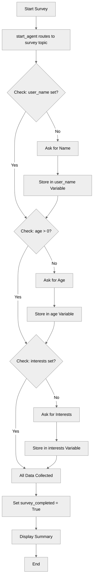

## Key Concepts

- **Variables block**: Where all agent state is defined
- **Variable types**: string, number, boolean, object
- **Mutable variables**: Can be changed by the agent during conversation
- **Linked variables**: Read-only values from external context
- **Default values**: Initial state for variables
- **Variable descriptions**: Document purpose for developers and LLM
- **Accessing variables**: Using `@variables.variable_name` syntax
- **Template expressions**: Using `{!@variables.name}` in instructions

## How It Works

### The Variables Block

All variables are defined in a global `variables` block:

```agentscript
variables:
   user_name: mutable string = ""
      description: "The user's full name"

   age: mutable number = 0
      description: "The user's age in years"
```

Variables defined here are accessible from any topic in your agent using `@variables.variable_name`.

### Variable Types

Agent Script supports several core types:

#### String Variables

```agentscript
user_name: mutable string = ""
   description: "The user's full name"
```

- Stores text values
- Default value: `""` (empty string)
- Use for: names, descriptions, identifiers, free-form text

#### Number Variables

```agentscript
age: mutable number = 0
   description: "The user's age in years"
```

- Stores numeric values (integers or decimals)
- Default value: `0`
- Use for: counts, ages, prices, quantities, calculations

#### Boolean Variables

```agentscript
survey_completed: mutable boolean = False
   description: "Whether the user has completed all survey questions"
```

- Stores true/false values
- Default value: `False`
- Use for: flags, status indicators, completion tracking
- **Important**: Use `True` and `False` (capitalized, Python-style)

### Mutable vs. Linked Variables

#### Mutable Variables

```agentscript
user_name: mutable string = ""
   description: "The user's full name"
```

- **Can be changed** by the agent
- Marked with `mutable` keyword
- Agent can `set` these values during execution
- Use for: data the agent collects or computes

### Variable Descriptions

```agentscript
user_name: mutable string = ""
   description: "The user's full name"
```

Descriptions serve two purposes:

1. **Documentation**: Explain what the variable stores
2. **LLM understanding**: Help the agent understand when and how to use the variable

### Accessing Variables in Instructions

Use the `@variables.` prefix to access variables, and `{!...}` for template interpolation:

```agentscript
reasoning:
   instructions:->
      if @variables.user_name:
         | - Name: {!@variables.user_name}
      else:
         | - Name: Not provided
```

Variables can be accessed:

- In template expressions with `{!@variables.name}`
- In conditionals: `if @variables.age > 0:`
- When setting values: `set @variables.name = "value"`

## Key Code Snippets

### Complete Variables Block

```agentscript
variables:
   user_name: mutable string = ""
      description: "The user's full name"

   age: mutable number = 0
      description: "The user's age in years"

   survey_completed: mutable boolean = False
      description: "Whether the user has completed all survey questions"

   interests: mutable string = ""
      description: "List of the user's interests and hobbies"
```

### Using Variables in Procedural Instructions

```agentscript
reasoning:
   instructions:->
      |
        Collect information from the user step by step.

        Current survey progress:
      if @variables.user_name:
         | - Name: {!@variables.user_name}
      else:
         | - Name: Not provided

      if @variables.age > 0:
         | - Age: {!@variables.age}
      else:
         | - Age: Not provided

      if @variables.interests:
         | - Interests: {!@variables.interests}
      else:
         | - Interests: Not provided

      | - Survey complete: {!@variables.survey_completed}
```

### Conditional Logic Based on Variables

```agentscript
if @variables.user_name:
   | - Name: {!@variables.user_name}
else:
   | - Name: Not provided
```

The `if/else` blocks control which template content is included based on variable values.

### start_agent Entry Point

```agentscript
start_agent topic_selector:
   description: "Welcome users and begin the survey process"

   reasoning:
      actions:
         begin_survey: @utils.transition to @topic.survey
            description: "Start collecting user information through the survey"
            available when @variables.survey_completed == False
```

## Try It Out

Here's how a conversation with this agent might flow:

### Example Interaction

```text
Agent: Welcome! I'd like to learn a bit about you. Let's start with your name.

User: My name is Alex

Agent: Nice to meet you, Alex! How old are you?

User: I'm 28

Agent: Thanks, Alex! What are some of your interests or hobbies?

User: I enjoy hiking, photography, and cooking

Agent: That's wonderful! Thank you for sharing, Alex. I've recorded:
       - Name: Alex
       - Age: 28
       - Interests: hiking, photography, cooking

       Your survey is now complete!
```

Behind the scenes, the agent is tracking:

- `user_name = "Alex"`
- `age = 28`
- `interests = "hiking, photography, cooking"`
- `survey_completed = True`

## Variable Best Practices

### Naming

- Use descriptive names: `user_email` not `email`
- Use snake_case: `first_name` not `firstName`
- Keep within 80 characters
- Only use letters, numbers, and underscores

### Descriptions

- Write clear, specific descriptions
- Explain what the variable stores
- Mention any constraints or formats
- These help both developers and the LLM

### Default Values

- Always provide sensible defaults for mutable variables
- Empty string `""` for text not yet collected
- `0` for numbers not yet known
- `False` for boolean flags

### Types

- Choose the simplest type that works
- Use `string` for most text
- Use `boolean` for yes/no flags

## What's Next?

This recipe shows how to declare and reference variables in instructions. To learn how to modify variables programmatically:

- **ActionDefinitions**: Learn about actions that capture outputs into variables
- **ActionCallbacks**: Use `set @variables.name = @outputs.value` to store action results
- **ReasoningInstructions**: Use the `set` keyword in procedural instructions

## Notes

- Variables are **global** within an agent - all topics can access all variables
- Variable names follow the same rules as agent names (letters, numbers, underscores only)
- Variables persist across conversation turns within the same session
- The `@` symbol is required when accessing resources like `@variables`, `@actions`, `@topic`

-----------------------------
# ActionCallbacks

## Overview

Learn how to use **post-action execution** with the `run` keyword to chain actions and process results. This pattern is essential for multi-step workflows where one action's completion triggers additional actions.

## Agent Flow

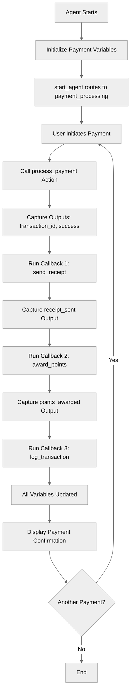

## Key Concepts

- **`run` keyword**: Execute actions after primary action completes
- **Post-action processing**: Handle action results immediately
- **Action chaining**: Sequential action execution within callbacks
- **One-level depth**: Only one level of `run` nesting allowed
- **Result capture**: Store outputs from each chained action

## How It Works

### Basic Post-Action Execution

After a primary action completes, use `run` to execute follow-up actions:

```agentscript
actions:
   make_payment: @actions.process_payment
      with amount=...
      with method=...
      # Capture primary action outputs
      set @variables.transaction_id = @outputs.transaction_id
      set @variables.payment_successful = @outputs.success
      # Run callback action
      run @actions.send_receipt
         with transaction_id=@variables.transaction_id
         with amount=@variables.payment_amount
         set @variables.receipt_sent = @outputs.sent
```

The `run` block executes **after** the primary action succeeds.

### Multiple Callback Actions

Chain multiple actions sequentially:

```agentscript
make_payment: @actions.process_payment
   with amount=...
   with method=...
   set @variables.transaction_id = @outputs.transaction_id
   set @variables.payment_successful = @outputs.success
   # Callback 1: Send receipt
   run @actions.send_receipt
      with transaction_id=@variables.transaction_id
      with amount=@variables.payment_amount
      set @variables.receipt_sent = @outputs.sent
   # Callback 2: Award loyalty points
   run @actions.award_points
      with amount=@variables.payment_amount
      set @variables.points_awarded = @outputs.points
   # Callback 3: Log for audit
   run @actions.log_transaction
      with transaction_id=@variables.transaction_id
```

Multiple `run` statements execute in sequence after the primary action.

### Complete Recipe Example

```agentscript
topic payment_processing:
   description: "Processes payments with callbacks"

   actions:
      process_payment:
         description: "Processes a payment transaction"
         inputs:
            amount: number
               description: "The payment amount to be processed"
            method: string
               description: "The mode of the payment"
         outputs:
            transaction_id: string
               description: "Unique identifier for the completed transaction"
            success: boolean
               description: "Indicates whether the payment was processed successfully"
         target: "flow://ProcessPayment"

      send_receipt:
         description: "Sends payment receipt"
         inputs:
            transaction_id: string
               description: "The transaction ID to include in the receipt"
            amount: number
               description: "The payment amount to display on the receipt"
         outputs:
            sent: boolean
               description: "Indicates whether the receipt was sent successfully"
         target: "flow://SendReceipt"

      award_points:
         description: "Awards loyalty points"
         inputs:
            amount: number
               description: "The payment amount used to calculate loyalty points"
         outputs:
            points: number
               description: "The number of loyalty points awarded to the customer"
         target: "flow://AwardLoyaltyPoints"

      log_transaction:
         description: "Logs transaction for audit"
         inputs:
            transaction_id: string
               description: "The transaction ID to be logged for audit purposes"
         outputs:
            success: boolean
               description: "Indicates whether the transaction was logged successfully"
         target: "flow://LogTransaction"

   reasoning:
      instructions:->
         | Process payments and handle post-payment tasks.

           Status:
           - Amount: ${!@variables.payment_amount}
           - Method: {!@variables.payment_method}

         if @variables.transaction_id:
            | - Transaction: {!@variables.transaction_id}
         else:
            | - Transaction: None

         | - Success: {!@variables.payment_successful}
           - Receipt sent: {!@variables.receipt_sent}
           - Points: {!@variables.points_awarded}

           Guide the user through the payment process.

           Store the amount first, then process the payment.

      actions:
         set_amount: @utils.setVariables
            with payment_amount=...
         make_payment: @actions.process_payment
            with amount=...
            with method=...
            set @variables.transaction_id = @outputs.transaction_id
            set @variables.payment_successful = @outputs.success
            run @actions.send_receipt
               with transaction_id=@variables.transaction_id
               with amount=@variables.payment_amount
               set @variables.receipt_sent = @outputs.sent
            run @actions.award_points
               with amount=@variables.payment_amount
               set @variables.points_awarded = @outputs.points
            run @actions.log_transaction
               with transaction_id=@variables.transaction_id
```

## Key Code Snippets

### Basic Callback Pattern

```agentscript
actions:
   primary_action: @actions.do_something
      with input=...
      set @variables.result = @outputs.data
      # Callback executes after primary action
      run @actions.handle_result
         with result_data=@variables.result
```

### Multi-Step Chain

```agentscript
create_order: @actions.create_order
   with customer_id=@variables.customer_id
   with items=...
   set @variables.order_id = @outputs.order_id
   # Step 1: Send confirmation
   run @actions.send_confirmation
      with order_id=@variables.order_id
      with email=@variables.customer_email
   # Step 2: Update inventory
   run @actions.update_inventory
      with order_id=@variables.order_id
   # Step 3: Log order
   run @actions.log_order
      with order_id=@variables.order_id
```

### Capturing Callback Outputs

```agentscript
process_payment: @actions.charge_card
   with amount=@variables.total
   set @variables.payment_id = @outputs.payment_id
   run @actions.send_receipt
      with payment_id=@variables.payment_id
      set @variables.receipt_sent = @outputs.sent
   run @actions.award_points
      with amount=@variables.total
      set @variables.points_earned = @outputs.points
```

Each `run` can capture its own outputs into variables.

## Try It Out

### Example: Payment Processing

```text
Agent: I'll help you process your payment securely.

User: Process a payment of $150 using credit card

[Agent calls process_payment action]
  → process_payment(amount=150, method="credit card")
  → Returns: transaction_id="TXN-456", success=true

  [Callback 1: send_receipt]
  → send_receipt(transaction_id="TXN-456", amount=150)
  → Returns: sent=true

  [Callback 2: award_points]
  → award_points(amount=150)
  → Returns: points=150

  [Callback 3: log_transaction]
  → log_transaction(transaction_id="TXN-456")

Agent: Payment processed successfully!
       - Transaction ID: TXN-456
       - Receipt sent: Yes
       - Loyalty points awarded: 150
```

### Behind the Scenes

1. Primary action `process_payment` executes first
2. Outputs captured: `transaction_id`, `success`
3. Callback 1 `send_receipt` runs with transaction data
4. Callback 2 `award_points` runs with amount
5. Callback 3 `log_transaction` runs for audit
6. All variables updated for agent to use in response

## Best Practices

✅ **Capture outputs immediately** - Save action results before chaining

✅ **One level only** - Don't nest run inside run

✅ **Clear dependencies** - Document what each callback expects

✅ **Use variables for data passing** - Store outputs in variables for callbacks

❌ **Don't nest deeply**

```agentscript
# NOT SUPPORTED:
run @actions.a
   run @actions.b  # Only one level allowed for now
```

✅ **Use sequential runs instead**

```agentscript
# Correct approach:
run @actions.step_a
   set @variables.result_a = @outputs.data
run @actions.step_b
   with input=@variables.result_a
run @actions.step_c
```

## When to Use Callbacks

### Use callbacks when:

- Need to perform follow-up actions after primary action
- Want to chain related operations (payment → receipt → points)
- Need to capture and pass data between actions
- Building audit trails or logs

### Don't use callbacks when:

- Actions are independent (use separate reasoning actions)
- Complex conditional logic needed (use `before_reasoning` instead)
- Need deep nesting (refactor into separate actions)

## What's Next

- **MultiStepWorkflows**: Build complex workflows with callbacks
- **ErrorHandling**: Add validation between actions
- **BeforeAfterReasoning**: Run actions outside of reasoning block
- **ActionDefinitions**: Learn how to define the actions being called

## Testing

Test callback execution:

### Test Case 1: Happy Path

- Process payment with valid inputs
- Verify all callbacks execute in sequence
- Check all variables populated

### Test Case 2: Primary Action Failure

- Simulate payment failure
- Verify callbacks don't execute
- Check error handling

### Test Case 3: Data Flow

- Verify outputs from primary action
- Check data passed to callbacks correctly
- Validate final variable state

-----------------------------------
# ActionDefinitions

## Overview

This recipe demonstrates how to define and use **actions** - the way Agent Script agents call external systems, APIs, and services. Actions are essential for agents that need to fetch data, perform operations, or integrate with external platforms.

## Agent Flow

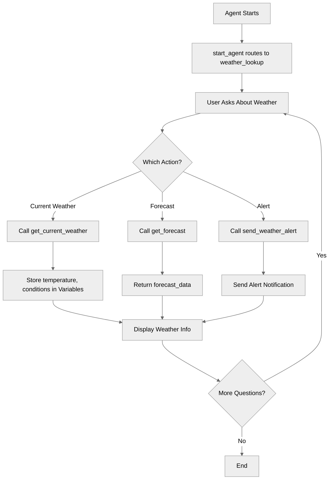

## Key Concepts

- **Actions block**: Where external capabilities are defined within a topic
- **Action structure**: description, inputs, outputs, target
- **Action targets**: `flow://` for Flows, `apex://` for Apex classes
- **Input binding**: Specifying action parameters with `with`
- **Output capture**: Storing action results with `set`
- **LLM slot-filling**: Using `...` for LLM-extracted parameters
- **Reasoning actions**: Making actions available during conversation

## How It Works

### Action Definition Anatomy

Every action has four key components:

```agentscript
get_current_weather:
   description: "Retrieves current weather conditions for a specified location"
   inputs:
      city_name: string
         description: "The name of the city to get weather for"
      units: string
         description: "Temperature units to use (fahrenheit, celsius, or kelvin)"
   outputs:
      temperature: number
         description: "Current temperature value in the specified units"
      weather_condition: string
         description: "Description of current weather (e.g., sunny, cloudy, rainy)"
      humidity: number
         description: "Current humidity percentage (0-100)"
      wind_speed: number
         description: "Current wind speed in miles per hour"
   target: "flow://GetCurrentWeather"
```

1. **Description**: Explains what the action does (helps the LLM decide when to use it)
2. **Inputs**: Parameters the action needs to execute, each with type and description
3. **Outputs**: Data the action returns, each with type and description
4. **Target**: Where the action executes (the external system)

### Action Targets

The `target` specifies where the action runs:

#### Salesforce Flow

```agentscript
target: "flow://GetCurrentWeather"
```

- Calls a Salesforce Flow
- Flow name follows `flow://`
- Most common integration method

#### Apex Class

```agentscript
target: "apex://WeatherAlertService"
```

- Calls a Salesforce Apex class
- Class name follows `apex://`
- Use for custom server-side logic

### Defining Actions in Topics

Actions are defined in the `actions:` block within a topic:

```agentscript
topic weather_lookup:
   description: "Looks up and reports weather information"

   actions:
      get_current_weather:
         description: "Retrieves current weather conditions for a specified location"
         inputs:
            city_name: string
               description: "The name of the city to get weather for"
            units: string
               description: "Temperature units to use (fahrenheit, celsius, or kelvin)"
         outputs:
            temperature: number
               description: "Current temperature value in the specified units"
            weather_condition: string
               description: "Description of current weather (e.g., sunny, cloudy, rainy)"
         target: "flow://GetCurrentWeather"
```

### Making Actions Available in Reasoning

Define actions, then make them available in `reasoning.actions:`:

```agentscript
reasoning:
   instructions:->
      | Help users get weather information for their requested locations.

   actions:
      get_current_weather: @actions.get_current_weather
         with city_name=...
         with units="fahrenheit"
         set @variables.current_temperature = @outputs.temperature
         set @variables.conditions = @outputs.weather_condition
```

This tells the agent:

- This action can be called during the conversation
- The LLM can choose when to call it
- Here's how to bind the inputs

### Input Binding Patterns

There are three ways to provide action inputs:

#### 1. LLM Slot-Filling (`...`)

```agentscript
with city_name=...
```

- The LLM extracts this from conversation
- Most flexible - agent figures out the value
- Use when users will provide the information

#### 2. Fixed Values

```agentscript
with units="fahrenheit"
```

- Hard-coded value
- Same every time the action runs
- Use for constants or defaults

#### 3. Variable Binding

```agentscript
with city_name=@variables.user_location
```

- Pulls value from a variable
- Use when you've stored the value earlier
- Ensures consistency

### Capturing Outputs

After an action runs, capture its outputs with `set`:

```agentscript
actions:
   get_current_weather: @actions.get_current_weather
      with city_name=...
      with units="fahrenheit"
      set @variables.current_temperature = @outputs.temperature
      set @variables.conditions = @outputs.weather_condition
```

- `@outputs.field_name` - access returned data
- `set @variables.name = value` - store for later use

## Key Code Snippets

### Complete Action Definition

```agentscript
actions:
   get_current_weather:
      description: "Retrieves current weather conditions for a specified location"
      inputs:
         city_name: string
            description: "The name of the city to get weather for"
         units: string
            description: "Temperature units to use (fahrenheit, celsius, or kelvin)"
      outputs:
         temperature: number
            description: "Current temperature value in the specified units"
         weather_condition: string
            description: "Description of current weather (e.g., sunny, cloudy, rainy)"
         humidity: number
            description: "Current humidity percentage (0-100)"
         wind_speed: number
            description: "Current wind speed in miles per hour"
      target: "flow://GetCurrentWeather"
```

### Action with List Output

```agentscript
get_forecast:
   description: "Retrieves 5-day weather forecast for a location"
   inputs:
      city_name: string
         description: "The name of the city to get forecast for"
      days: number
         description: "Number of days to include in the forecast (1-10)"
   outputs:
      forecast_data: list[string]
         description: "List of daily forecast objects containing temperature, conditions, and precipitation data"
   target: "flow://GetWeatherForecast"
```

### Action with Apex Target

```agentscript
send_weather_alert:
   description: "Sends a weather alert notification to the user"
   inputs:
      message: string
         description: "The alert message content to send to the user"
      severity: string
         description: "Severity level of the alert (low, medium, high, or critical)"
   outputs:
      alertMessage: string
         description: "The formatted weather alert message that was sent"
   target: "apex://WeatherAlertService"
```

### Making Actions Available to LLM

```agentscript
reasoning:
   instructions:->
      | Help users get weather information for their requested locations and send weather alerts.

        Current data:

      if @variables.location:
         | - Location: {!@variables.location}
      else:
         | - Location: None specified

      if @variables.current_temperature > 0:
         | - Temperature: {!@variables.current_temperature}
      else:
         | - Temperature: Not fetched

      if @variables.conditions:
         | - Conditions: {!@variables.conditions}
      else:
         | - Conditions: Not fetched

      | When a user asks about weather:
        1. Identify the location they're asking about
        2. Use {!@actions.get_current_weather} to fetch current conditions
        3. Store the results in variables
        4. Report the weather clearly to the user

        If the user asks to send a weather alert, use {!@actions.send_alert} to send the alert

   actions:
      get_current_weather: @actions.get_current_weather
         with city_name=...
         with units="fahrenheit"
         set @variables.current_temperature = @outputs.temperature
         set @variables.conditions = @outputs.weather_condition

      get_forecast: @actions.get_forecast
         with city_name=...
         with days=5

      send_alert: @actions.send_weather_alert
         with message=...
         with severity=...
```

## Try It Out

Here's how a conversation with this agent flows:

### Example Interaction

```text
Agent: Hi! I can help you check the weather. What location would you like to know about?

User: What's the weather like in San Francisco?

[Agent calls get_current_weather action with city_name="San Francisco"]

Agent: In San Francisco, it's currently 65°F with partly cloudy conditions. The humidity is 72% and winds are at 8 mph. Would you like to see the 5-day forecast?

User: Yes, show me the forecast

[Agent calls get_forecast action]

Agent: Here's the 5-day forecast for San Francisco:
       - Monday: Partly cloudy, high of 67°F
       - Tuesday: Sunny, high of 70°F
       - Wednesday: Cloudy, high of 64°F
       - Thursday: Rain, high of 61°F
       - Friday: Partly cloudy, high of 66°F

User: Send a weather alert

[Agent calls send_weather_alert action]

Agent: A weather alert has been sent for San Francisco: Sunny conditions with a temperature of 72.5°F. Stay hydrated and wear sun protection if outdoors!
```

### Behind the Scenes

When user says "San Francisco":

1. Agent recognizes this is a weather request
2. LLM chooses to call `get_current_weather`
3. LLM extracts `city_name = "San Francisco"` (slot-filling)
4. Action executes: Flow is called with inputs
5. Outputs are returned: `temperature=65`, `weather_condition="partly cloudy"`, etc.
6. Values are stored: `@variables.current_temperature = 65`
7. Agent uses stored data to respond naturally

## Action Design Best Practices

### Inputs

- Keep inputs minimal - only what's needed
- Use clear, descriptive parameter names
- Choose appropriate types (string, number, boolean)
- Add detailed descriptions to help LLM understand

### Outputs

- Return only useful data
- Use structured types (`object`, `list[object]`) for complex data
- Match output types to how you'll use the data
- Add descriptions explaining what each output contains

### Descriptions

**Good descriptions:**

- "Retrieves current weather conditions for a specified location"
- "Sends a weather alert notification to the user"
- "Searches for products matching the query"

**Poor descriptions:**

- "Gets weather" (too vague)
- "This action calls the weather API endpoint and returns..." (too technical)
- "" (missing!)

## What's Next

Actions are powerful, but this recipe shows basics. To learn more:

- **ActionCallbacks**: Chain actions with `run` for multi-step processes
- **AdvancedInputBindings**: Master all input binding patterns
- **ActionDescriptionOverrides**: Adapt descriptions by context
- **DynamicActionRouting**: Control action availability with `available when`

## Testing

To test this agent, you'll need to create the referenced Salesforce Flows:

**GetCurrentWeather Flow:**

- Input: `city_name` (Text), `units` (Text)
- Output: `temperature` (Number), `weather_condition` (Text), `humidity` (Number), `wind_speed` (Number)
- Logic: Call a weather API (OpenWeather, WeatherAPI, etc.)

**GetWeatherForecast Flow:**

- Input: `city_name` (Text), `days` (Number)
- Output: `forecast_data` (Collection)
- Logic: Call forecast API endpoint

**WeatherAlertService Apex:**

- Method: `sendAlert(String message, String severity)`
- Logic: Send notification (email, SMS, platform event)

-------------------------------------
# ActionDescriptionOverrides

## Overview

Master **context-specific action descriptions** to improve LLM action selection. Learn how to define different action descriptions for different topics based on user expertise, context, and conversation state for more accurate tool calling.

## Agent Flow

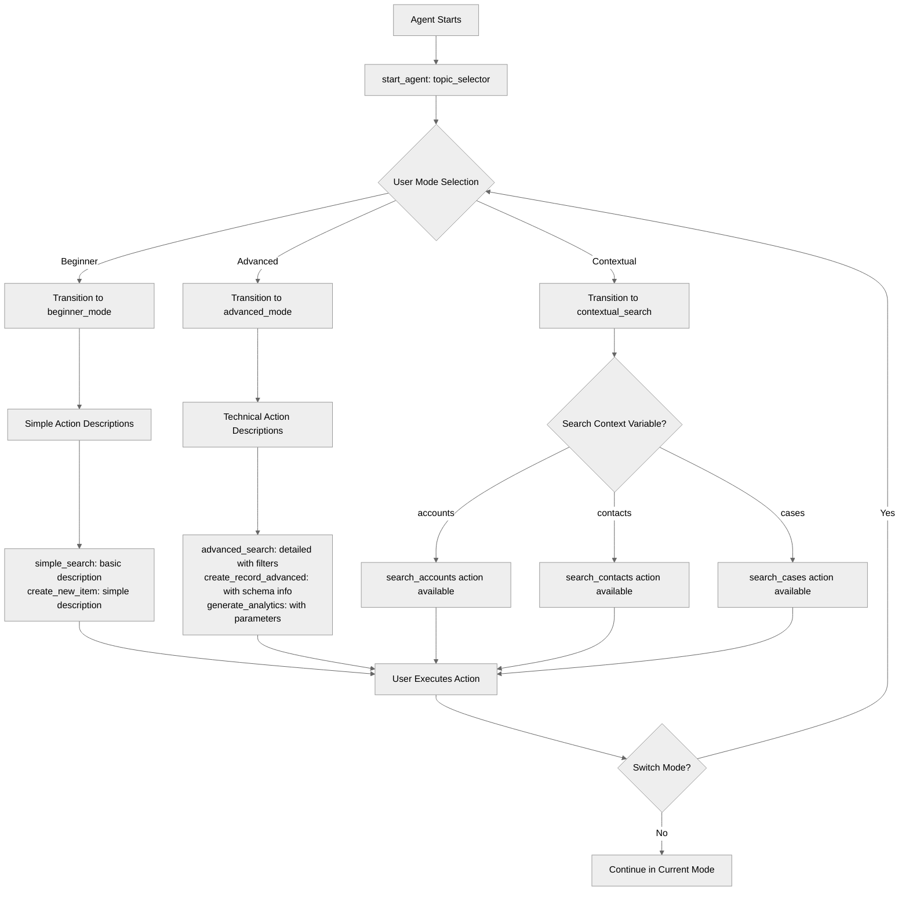

## Key Concepts

- **Topic-level action definitions**: Each topic can define actions with different descriptions
- **Context-aware descriptions**: Adapt descriptions to user level
- **Expertise-based descriptions**: Different detail levels for beginners vs experts
- **Conditional availability**: Use `available when` to show actions based on context
- **Improved LLM selection**: Better descriptions = better tool choices

## How It Works

### Base Action Definition in Topic

Each topic defines its own version of actions with appropriate descriptions:

```agentscript
topic beginner_mode:
   description: "Simplified interface for beginners"

   actions:
      perform_search:
         description: "Search the knowledge base"
         inputs:
            query: string
               description: "Search query text to find relevant articles"
            filters: object
               description: "Filter criteria object to refine search results"
         outputs:
            results: list[object]
               description: "List of search result objects"
         target: "flow://PerformSearch"
```

### Different Descriptions Per Topic

The same underlying action can have different descriptions in different topics:

```agentscript
# Beginner mode - simple descriptions
topic beginner_mode:
   actions:
      perform_search:
         description: "Search the knowledge base"
         ...

# Advanced mode - detailed technical descriptions
topic advanced_mode:
   actions:
      perform_search:
         description: "Execute knowledge base query with advanced filters (supports: type, date range, tags, custom fields). Returns paginated results with relevance scoring."
         inputs:
            query: string
               description: "Search query text with support for advanced syntax and operators"
            filters: object
               description: "Advanced filter criteria object with type, date range, tags, and custom field filters"
         ...
```

### Context-Based Action Availability

Use `available when` to show actions only in specific contexts:

```agentscript
topic contextual_search:
   reasoning:
      actions:
         search_accounts: @actions.perform_search
            available when @variables.search_context == "accounts"
            with query=...
            with filters=...

         search_contacts: @actions.perform_search
            available when @variables.search_context == "contacts"
            with query=...
            with filters=...

         search_cases: @actions.perform_search
            available when @variables.search_context == "cases"
            with query=...
            with filters=...
```

## Key Code Snippets

### Beginner Mode with Simple Descriptions

```agentscript
topic beginner_mode:
   description: "Simplified interface for beginners"

   actions:
      perform_search:
         description: "Search the knowledge base"
         inputs:
            query: string
               description: "Search query text to find relevant knowledge base articles"
            filters: object
               description: "Filter criteria object to refine search results"
         outputs:
            results: list[object]
               description: "List of search result objects containing matching articles"
         target: "flow://PerformSearch"

      create_record:
         description: "Create a new record"
         inputs:
            record_type: string
               description: "Type of record to create"
            data: object
               description: "Record data object containing field-value pairs"
         outputs:
            record_id: string
               description: "Unique identifier of the newly created record"
         target: "flow://CreateRecord"

   reasoning:
      instructions:->
         | Beginner Mode - Simplified Interface

           I'll help you with basic tasks using simple language.

      actions:
         simple_search: @actions.perform_search
            with query=...
            with filters=...

         create_new_item: @actions.create_record
            with record_type=...
            with data=...

         switch_to_advanced: @utils.transition to @topic.advanced_mode
```

### Advanced Mode with Technical Descriptions

```agentscript
topic advanced_mode:
   description: "Full-featured interface for advanced users"

   actions:
      perform_search:
         description: "Execute knowledge base query with advanced filters (supports: type, date range, tags, custom fields). Returns paginated results with relevance scoring."
         inputs:
            query: string
               description: "Search query text with support for advanced syntax and operators"
            filters: object
               description: "Advanced filter criteria object with type, date range, tags, and custom field filters"
         outputs:
            results: list[object]
               description: "Paginated list of search result objects with relevance scores"
         target: "flow://PerformSearch"

      create_record:
         description: "Create new database record. Specify record_type (Account, Contact, Case, Custom__c) and provide data object with field-value pairs. Returns record ID on success."
         inputs:
            record_type: string
               description: "Database record type (Account, Contact, Case, Custom__c, etc.)"
            data: object
               description: "Record data object with field-value pairs matching the specified record type schema"
         outputs:
            record_id: string
               description: "Unique 18-character Salesforce record ID"
         target: "flow://CreateRecord"

      generate_report:
         description: "Generate analytics report. Available types: sales_summary, user_activity, performance_metrics. Accepts parameters object for date ranges, filters, and aggregation options."
         inputs:
            report_type: string
               description: "Report type (sales_summary, user_activity, performance_metrics, etc.)"
            parameters: object
               description: "Report parameters object with date ranges, filters, and aggregation options"
         outputs:
            report_url: string
               description: "URL to access or download the generated report"
         target: "flow://GenerateReport"

   reasoning:
      instructions:->
         | Advanced Mode - Full Technical Interface
         |
         | All features available with detailed technical descriptions.

      actions:
         advanced_search: @actions.perform_search
            with query=...
            with filters=...

         create_record_advanced: @actions.create_record
            with record_type=...
            with data=...

         generate_analytics: @actions.generate_report
            with report_type=...
            with parameters=...

         switch_to_beginner: @utils.transition to @topic.beginner_mode
```

### Context-Aware Search Actions

```agentscript
topic contextual_search:
   description: "Search with context-specific descriptions"

   actions:
      perform_search:
         description: "Search the knowledge base"
         inputs:
            query: string
               description: "Search query text adapted to the current search context"
            filters: object
               description: "Context-specific filter criteria object"
         outputs:
            results: list[object]
               description: "List of context-relevant search result objects"
         target: "flow://PerformSearch"

   reasoning:
      instructions:->
         | Context-Aware Search Interface

           Search descriptions adapt based on what you're looking for.

      actions:
         search_accounts: @actions.perform_search
            available when @variables.search_context == "accounts"
            with query=...
            with filters=...

         search_contacts: @actions.perform_search
            available when @variables.search_context == "contacts"
            with query=...
            with filters=...

         search_cases: @actions.perform_search
            available when @variables.search_context == "cases"
            with query=...
            with filters=...
```

## Try It Out

### Example: Beginner Mode

```text
User: Find information about pricing

Agent sees action:
  simple_search: "Search the knowledge base"

LLM thinks: "User wants to find information, use simple_search"

Agent: [Calls perform_search with query="pricing"]
       Here's what I found about pricing...
```

### Example: Advanced Mode

```text
User: I am an advanced user. Query the knowledge base for articles tagged "API" from last 30 days.

Agent sees action:
  advanced_search: "Execute knowledge base query with advanced filters (supports: type, date range, tags, custom fields). Returns paginated results."

LLM thinks: "User wants advanced query with filters, use advanced_search"

Agent: [Calls perform_search with query="API" and complex filters]
       Found 15 API articles from the last 30 days...
```

### Example: Context-Aware

```text
User: Search for contact John Smith

[Context: search_context = "accounts"]
Agent sees: search_accounts action available

Agent: [Searches accounts]
       Found 3 companies with "John Smith" in the name

---

User: Search for John Smith

[Context: search_context = "contacts"]
Agent sees: search_contacts action available

Agent: [Searches contacts]
       Found 5 contacts named John Smith
```

## Why Different Descriptions?

### Better LLM Understanding

- Clearer descriptions = better tool selection
- Context-specific language matches user intent
- Reduces wrong tool calls

### Expertise Adaptation

- Beginners get simple explanations
- Experts get technical details
- Appropriate for skill level

### Context Clarity

- Actions described for current context
- Reduces ambiguity
- Guides LLM to right tool

## Best Practices

✅ **Match user expertise** - Beginners need simple, experts need detailed

✅ **Be specific** - Describe what action does in this context

✅ **Use clear language** - Avoid jargon unless in advanced mode

✅ **Document parameters** - Explain what inputs are available

❌ **Don't use same description** - If context matters, customize it

❌ **Don't be vague** - Specific descriptions help LLM choose correctly

## Description Guidelines

### Beginner Descriptions

- Use plain language
- Focus on outcome
- Hide technical details
- Example: "Search the knowledge base"

### Advanced Descriptions

- Use technical terms
- Explain parameters
- Include capabilities
- Example: "Execute query with advanced filters (type, date range, tags). Returns paginated results with relevance scoring."

### Context-Specific Descriptions

- Mention the context
- Explain what it searches
- Be concrete
- Example: "Search customer accounts by name, industry, location"

## What's Next

- **DynamicActionRouting**: Combine with `available when` patterns
- **SystemInstructionOverrides**: Use with persona changes
- **AdvancedReasoningPatterns**: Build sophisticated selection logic

## Testing

Test description effectiveness:

### Test Case 1: Beginner Mode

- Use beginner-friendly descriptions
- Test LLM selects correct action
- Verify simple language works

### Test Case 2: Advanced Mode

- Use technical descriptions
- Test with complex requests
- Verify detailed descriptions help

### Test Case 3: Context Switching

- Switch between contexts
- Verify actions adapt
- Check LLM selects appropriately

### Test Case 4: Ambiguous Request

- Give ambiguous input
- Verify context-specific action guides LLM
- Check correct action chosen
--------------------------
# AdvancedInputBindings

## Overview

Master **all action input binding patterns** in Agent Script. Learn when to let the LLM fill slots, when to bind variables, when to use fixed values, and how to combine all patterns for sophisticated action calls.

## Agent Flow

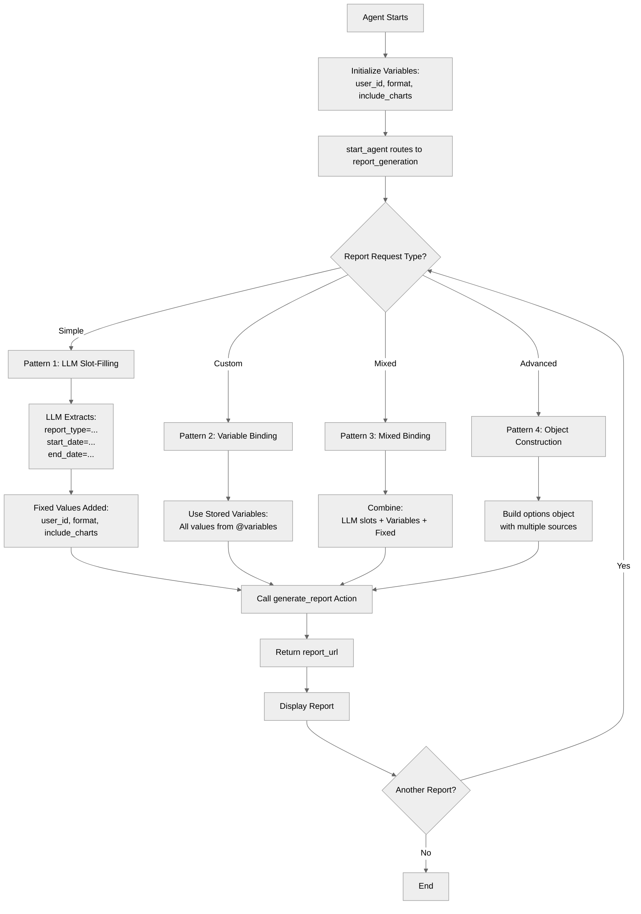

## Key Concepts

- **LLM slot-filling (`...`)**: Let AI extract values from conversation
- **Fixed values**: Hardcoded inputs that never change
- **Variable binding**: Pass existing variable values with `@variables.name`
- **Mixed binding**: Combine LLM, fixed, and variable inputs
- **Pattern selection**: Choose the right binding for each input

## How It Works

### Pattern 1: LLM Slot-Filling with `...`

Let the LLM extract values from the user's natural language:

```agentscript
actions:
   create_simple_report: @actions.generate_report
      description: "Generate a new report where the user provides all details (type, dates, etc.) explicitly."
      with report_type=...
      with start_date=...
      with end_date=...
      with user_id=@variables.user_id
      with format="pdf"
      with include_charts=True
      with options=...
```

**User**: "Generate a sales report for January 2025"
**LLM extracts**:

- report_type: "sales"
- start_date: "2025-01-01"
- end_date: "2025-01-31"

### Pattern 2: Variable Binding

Use stored variable values for all inputs:

```agentscript
actions:
   create_custom_report: @actions.generate_report
      description: "Generate a report using ONLY the previously stored variable values for type, dates, and settings."
      available when @variables.report_type != ""
      with report_type=@variables.report_type
      with start_date=@variables.start_date
      with end_date=@variables.end_date
      with user_id=@variables.user_id
      with format=@variables.format
      with include_charts=@variables.include_charts
      with options=...
```

All inputs come from previously stored variables.

### Pattern 3: Mixed Binding

Combine LLM extraction, variables, and fixed values:

```agentscript
actions:
   create_mixed_report: @actions.generate_report
      description: "Generate a report with a NEW report type provided by the user, but reusing the START and END DATES from stored variables. Use this when user says 'with those dates'."
      available when @variables.start_date != ""
      with report_type=...                    # LLM extracts from conversation
      with start_date=@variables.start_date   # From stored variable
      with end_date=@variables.end_date       # From stored variable
      with user_id=@variables.user_id         # From stored variable
      with format="pdf"                       # Fixed value
      with include_charts=True                # Fixed value
      with options=...                        # LLM extracts
```

## Key Code Snippets

### Complete Topic with All Patterns

```agentscript
topic report_generation:
   description: "Generates reports with various input binding patterns"

   actions:
      generate_report:
         description: "Generates a custom report"
         inputs:
            report_type: string
               description: "Type of report to generate (e.g., sales, analytics, performance, financial)"
            start_date: string
               description: "Report start date in ISO format (YYYY-MM-DD)"
            end_date: string
               description: "Report end date in ISO format (YYYY-MM-DD)"
            user_id: string
               description: "The unique identifier of the user generating the report"
            format: string
               description: "Output format for the report (pdf, csv, excel, or html)"
            include_charts: boolean
               description: "Whether to include visual charts and graphs"
            options: object
               description: "Additional report configuration options"
         outputs:
            report_url: string
               description: "URL where the generated report can be accessed"
            success: boolean
               description: "Indicates whether the report was generated successfully"
         target: "flow://GenerateReport"

   reasoning:
      instructions:->
         | Generate reports with custom parameters.

           Help user specify:
           - Report type
           - Date range
           - Output format

      actions:
         # Pattern 1: LLM slot-filling (...)
         # LLM extracts values from conversation
         create_simple_report: @actions.generate_report
            description: "Generate a new report where the user provides all details (type, dates, etc.) explicitly."
            with report_type=...
            with start_date=...
            with end_date=...
            # Fixed values
            with user_id=@variables.user_id
            with format="pdf"
            with include_charts=True
            with options=...

            # Capture values into variables for future use
            set @variables.report_type = @outputs.report_type
            set @variables.start_date = @outputs.start_date
            set @variables.end_date = @outputs.end_date
            set @variables.user_id = @outputs.user_id
            set @variables.format = @outputs.format
            set @variables.include_charts = @outputs.include_charts

         # Pattern 2: Variable binding
         # Use stored variable values
         create_custom_report: @actions.generate_report
            description: "Generate a report using ONLY the previously stored variable values for type, dates, and settings."
            available when @variables.report_type != ""
            with report_type=@variables.report_type
            with start_date=@variables.start_date
            with end_date=@variables.end_date
            with user_id=@variables.user_id
            with format=@variables.format
            with include_charts=@variables.include_charts
            with options=...

         # Pattern 3: Mixed binding
         # Combine fixed, variable, and LLM-filled
         create_mixed_report: @actions.generate_report
            description: "Generate a report with a NEW report type provided by the user, but reusing the START and END DATES from stored variables. Use this when user says 'with those dates'."
            available when @variables.start_date != ""
            with report_type=...
            with start_date=@variables.start_date
            with end_date=@variables.end_date
            with user_id=@variables.user_id
            with format="pdf"
            with include_charts=True
            with options=...
```

### Variables Supporting the Patterns

```agentscript
variables:
   report_type: mutable string = ""
      description: "Type of report to generate"

   start_date: mutable string = ""
      description: "Report start date"

   end_date: mutable string = ""
      description: "Report end date"

   user_id: mutable string = "USER123"
      description: "Current user ID (preset)"

   include_charts: mutable boolean = True
      description: "Whether to include charts"

   format: mutable string = "pdf"
      description: "Output format"
```

## Try It Out

### Example 1: LLM Slot-Filling

```text
User: Generate a sales report for Q1 2025

[Agent uses create_simple_report action]
LLM extracts:
  - report_type: "sales"
  - start_date: "2025-01-01"
  - end_date: "2025-03-31"

Fixed values applied:
  - user_id: "USER123" (from @variables)
  - format: "pdf"
  - include_charts: True

Agent: Your Q1 2025 sales report has been generated as a PDF with charts.
       Download: [report_url]
```

### Example 2: Variable Binding

```text
[Variables already set from previous conversation]
- report_type = "analytics"
- start_date = "2025-01-01"
- end_date = "2025-01-31"
- format = "excel"
- include_charts = False

User: Generate my custom report with saved settings

[Agent uses create_custom_report action]
All values from @variables

Agent: Your analytics report for January 2025 has been generated as Excel.
       Download: [report_url]
```

### Example 3: Mixed Binding

```text
[Variables set: start_date="2025-01-01", end_date="2025-01-31"]

User: Create a performance report with those dates

[Agent uses create_mixed_report action]
- report_type: "performance" (LLM extracted)
- start_date: "2025-01-01" (from @variables)
- end_date: "2025-01-31" (from @variables)
- format: "pdf" (fixed)

Agent: Your performance report for January 2025 is ready.
```

## When to Use Each Pattern

### Use LLM Slot-Filling (`...`) when:

- Value comes from user's natural language
- Value is unknown until user provides it
- Examples: dates, names, descriptions, search queries

### Use Fixed Values when:

- Value never changes
- System-level constants
- Default settings
- Examples: version numbers, default formats, system IDs

### Use Variable Binding when:

- Value already captured in previous turn
- Data from earlier actions
- User preferences stored earlier
- Examples: customer_id, user_id, session data

### Use Mixed Binding when:

- Action needs combination of all three
- Some inputs from user, some from state, some fixed
- Complex actions with many parameters

## Best Practices

### Clear Input Strategy

✅ **Good:**

```agentscript
create_report: @actions.generate_report
   with report_type=...                   # User provides
   with user_id=@variables.user_id        # From state
   with format="pdf"                      # Fixed default
```

❌ **Poor:**

```agentscript
create_report: @actions.generate_report
   with report_type=...
   with user_id=...        # Should be from variable!
```

### Don't Use `...` for Known Values

❌ **Problem:**

```agentscript
update_order: @actions.update_order
   with order_id=...  # LLM shouldn't guess this!
```

✅ **Solution:**

```agentscript
update_order: @actions.update_order
   with order_id=@variables.order_id
```

### Don't Hardcode User Input

❌ **Problem:**

```agentscript
create_ticket: @actions.create_ticket
   with title="Support Request"  # Should be from user!
```

✅ **Solution:**

```agentscript
create_ticket: @actions.create_ticket
   with title=...
```

## What's Next

- **ActionDefinitions**: Define actions that use these patterns
- **ActionCallbacks**: Chain actions with `run` keyword
- **ComplexStateManagement**: Work with complex variable types
- **VariableManagement**: Store data for binding

## Testing

Test all binding patterns:

### Test LLM Slot-Filling

- Provide values in natural language
- Verify LLM extracts correctly
- Test with missing values

### Test Fixed Values

- Verify constants never change
- Check default values applied correctly

### Test Variable Binding

- Set variables in previous turns
- Verify bound correctly in actions
- Test with empty/unset variables

### Test Mixed Binding

- Combine all three patterns
- Verify each type works correctly
- Test pattern selection by LLM

# BeforeAfterReasoning

## Overview

Learn how to use **reasoning lifecycle events** with `before_reasoning` and `after_reasoning`. These hooks let you execute code before and after every reasoning step, enabling initialization, logging, cleanup, and state management patterns.

## Agent Flow

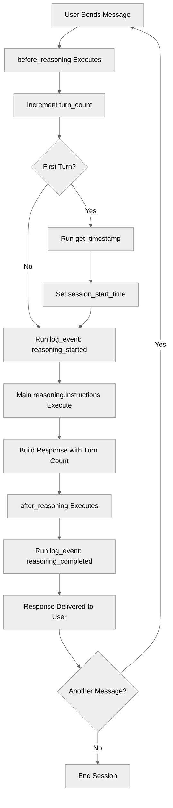

## Key Concepts

- **`before_reasoning`**: Executes before every reasoning step
- **`after_reasoning`**: Executes after every reasoning step
- **Lifecycle hooks**: Automatic execution on every turn
- **Initialization patterns**: Setup state on first turn
- **Logging patterns**: Track every interaction
- **State updates**: Modify variables at lifecycle points

## How It Works

### before_reasoning Block

Runs **before** the agent processes each user message:

```agentscript
topic conversation:
   before_reasoning:
      # Increment turn counter
      set @variables.turn_count = @variables.turn_count + 1

      # Initialize on first turn
      if @variables.turn_count == 1:
         run @actions.get_timestamp
            set @variables.session_start_time = @outputs.current_timestamp

      # Log the reasoning start
      run @actions.log_event
         with event_type="reasoning_started"
         with event_data="Turn: {!@variables.turn_count}"
```

**Use for:**

- Incrementing counters
- Initializing session state
- Loading required data
- Logging start of operations

### after_reasoning Block

Runs **after** the agent completes reasoning:

```agentscript
topic conversation:
   after_reasoning:
      # Log the reasoning completion
      run @actions.log_event
         with event_type="reasoning_completed"
         with event_data="Turn {!@variables.turn_count} completed"
```

**Use for:**

- Logging completion
- Cleanup operations
- Analytics tracking

### Complete Topic Structure

```agentscript
topic conversation:
   description: "Provides a conversation with lifecycle event tracking"

   actions:
      get_timestamp:
         description: "Get current timestamp"
         outputs:
            current_timestamp: string
               description: "Current timestamp in ISO 8601 format"
         target: "flow://GetCurrentTimestamp"

      log_event:
         description: "Log an event to the system"
         inputs:
            event_type: string
               description: "Type of event being logged"
            event_data: string
               description: "Additional data or context about the event"
         outputs:
            logged: boolean
               description: "Indicates whether the event was successfully logged"
         target: "flow://LogEvent"

   before_reasoning:
      set @variables.turn_count = @variables.turn_count + 1
      if @variables.turn_count == 1:
         run @actions.get_timestamp
            set @variables.session_start_time = @outputs.current_timestamp
      run @actions.log_event
         with event_type="reasoning_started"
         with event_data="Turn: {!@variables.turn_count}"

   reasoning:
      instructions:->
         | Every time you interact with the user, respond to their message and append the session info with turn count to your response.
         |
         | Session Start: {!@variables.session_start_time}
         | Current Turn Count: {!@variables.turn_count}

   after_reasoning:
      run @actions.log_event
         with event_type="reasoning_completed"
         with event_data="Turn {!@variables.turn_count} completed"
```

## Key Code Snippets

### Turn Counter Pattern

```agentscript
variables:
   turn_count: mutable number = 0
      description: "Number of conversation turns"

topic conversation:
   before_reasoning:
      set @variables.turn_count = @variables.turn_count + 1
```

### Session Initialization Pattern

```agentscript
before_reasoning:
   if @variables.turn_count == 1:
      run @actions.get_timestamp
         set @variables.session_start_time = @outputs.current_timestamp
```

### Logging Pattern

```agentscript
before_reasoning:
   run @actions.log_event
      with event_type="reasoning_started"
      with event_data="Turn: {!@variables.turn_count}"

after_reasoning:
   run @actions.log_event
      with event_type="reasoning_completed"
      with event_data="Turn {!@variables.turn_count} completed"
```

## Try It Out

### Example: Turn Counter and Logging

```text
[Turn 1]
User: Hello

[before_reasoning executes:]
  - turn_count = 1
  - get_timestamp → session_start_time set
  - log_event("reasoning_started", "Turn: 1")

[reasoning executes:]
  - Instructions built with turn count

Agent: Hello! Welcome to the conversation. Current Turn Count: 1

[after_reasoning executes:]
  - log_event("reasoning_completed", "Turn 1 completed")

---

[Turn 2]
User: How are you?

[before_reasoning executes:]
  - turn_count = 2
  - log_event("reasoning_started", "Turn: 2")

[reasoning executes:]
  - Instructions built with turn count

Agent: I'm great! Current Turn Count: 2

[after_reasoning executes:]
  - log_event("reasoning_completed", "Turn 2 completed")
```

## Common Use Cases

### Session Initialization

```agentscript
before_reasoning:
   if @variables.turn_count == 1:
      run @actions.init_session
         with session_id=@variables.session_id
```

### Pre-loading Data

```agentscript
before_reasoning:
   if @variables.user_id and not @variables.user_profile:
      run @actions.fetch_user_profile
         with user_id=@variables.user_id
         set @variables.user_profile = @outputs.profile
```

### Activity Tracking

```agentscript
after_reasoning:
   run @actions.update_last_activity
      with session_id=@variables.session_id
```

### Comprehensive Logging

```agentscript
before_reasoning:
   run @actions.log_event
      with event_type="turn_started"
      with event_data="Turn {!@variables.turn_count}"

after_reasoning:
   run @actions.log_event
      with event_type="turn_completed"
      with event_data="Turn {!@variables.turn_count}"
```

## Best Practices

✅ **Keep before_reasoning fast** - Avoid slow operations that delay responses

✅ **Use after_reasoning for logging** - Don't block the response

✅ **Initialize once** - Check flags to avoid re-initialization

✅ **Handle errors gracefully** - Don't let lifecycle events break reasoning

❌ **Don't overload lifecycle events** - Keep them focused and efficient

❌ **Don't use for main logic** - Use reasoning instructions instead

## Lifecycle vs Instructions

| Aspect               | before_reasoning | instructions:->    | after_reasoning |
| -------------------- | ---------------- | ------------------ | --------------- |
| **When**             | Before reasoning | During reasoning   | After reasoning |
| **Purpose**          | Setup, init      | Build instructions | Cleanup, log    |
| **Actions**          | Yes              | Yes                | Yes             |
| **Templates**        | No               | Yes                | No              |
| **Affects response** | Indirectly       | Directly           | No              |

## What's Next

- **AdvancedReasoningPatterns**: Combine lifecycle with complex logic
- **ContextHandling**: Load context in before_reasoning
- **ReasoningInstructions**: Master procedural instructions

## Testing

Test lifecycle execution:

### Test Case 1: First Turn

- Verify before_reasoning initializes correctly
- Check turn counter starts at 1
- Confirm session_start_time is set
- Verify after_reasoning executes

### Test Case 2: Multiple Turns

- Run 5 consecutive turns
- Verify turn counter increments correctly
- Check timestamps update each turn
- Verify all log events recorded

### Test Case 3: Logging Sequence

- Verify log events in correct order:
    1. reasoning_started (in before_reasoning)
    2. reasoning_completed (in after_reasoning)

-----------------------------
# ReasoningInstructions

## Overview

This recipe demonstrates **procedural reasoning instructions** - a powerful way to build dynamic, context-aware agents. Using the `instructions:->` syntax, you can execute code that runs actions, checks conditions, and builds instructions programmatically before each reasoning turn.

## Agent Flow

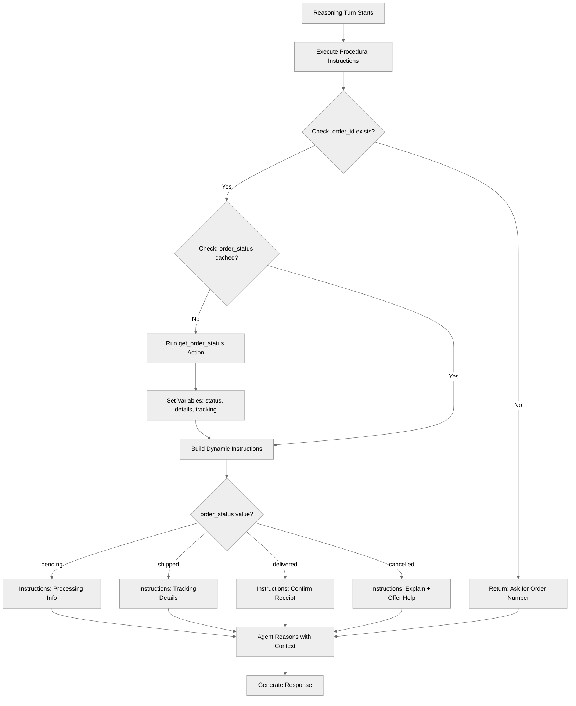

## Key Concepts

- **Procedural instructions**: Using `instructions:->` instead of static text
- **Pre-reasoning execution**: Code runs before the agent starts thinking
- **Dynamic instruction building**: Creating instructions based on current state
- **Template strings**: Using `|` to append to instruction text
- **Action calls in procedures**: Running actions to fetch data within instructions
- **Conditional instruction branches**: Different guidance for different scenarios

## How It Works

### Procedural Instructions Syntax

Use `instructions:->` to create a procedure that runs before reasoning:

```agentscript
reasoning:
   instructions:->
      # Code can check conditions
      if not @variables.order_id:
         | Ask the customer for their order number so you can look up the status.

      # Code can call actions
      if @variables.order_id and not @variables.order_status:
         run @actions.get_order_status
            with order_id=@variables.order_id
            set @variables.order_status = @outputs.status
            set @variables.order_details = @outputs.details
            set @variables.tracking_number = @outputs.tracking_number

      # Build dynamic instructions with |
      | The customer's order {!@variables.order_id} has status: {!@variables.order_status}
```

### Building Instructions with `|`

The `|` character appends text to the instruction string:

```agentscript
instructions:->
   | You are helping with order {!@variables.order_id}.

   if @variables.order_status == "shipped":
      | The order has shipped. Provide tracking details.

   | Always be helpful and proactive.
```

Result is a single instruction string built from all the `|` lines that are reached.

### Calling Actions to Fetch Data

Fetch data you need to build accurate instructions:

```agentscript
instructions:->
   if @variables.order_id and not @variables.order_status:
      run @actions.get_order_status
         with order_id=@variables.order_id
         set @variables.order_status = @outputs.status
         set @variables.tracking_number = @outputs.tracking_number

   | Order {!@variables.order_id} status: {!@variables.order_status}
```

### Conditional Instruction Branches

Provide different guidance based on state:

```agentscript
instructions:->
   if @variables.order_status == "pending":
      | The order is being processed. Let the customer know:
        Order is confirmed and being prepared
        They'll receive tracking info within 24 hours

   if @variables.order_status == "shipped":
      | The order has been shipped! Provide:
        Tracking number: {!@variables.tracking_number}
        Estimated delivery date from order details

   if @variables.order_status == "delivered":
      | The order was delivered.
        Confirm they received it
        Ask if everything was satisfactory

   if @variables.order_status == "cancelled":
      | This order was cancelled.
        Explain the cancellation
        Check if refund was processed
        Ask if they'd like to place a new order
```

## Key Code Snippets

### Complete Topic from Recipe

```agentscript
topic order_status:
   description: "Looks up and explains order status"

   actions:
      get_order_status:
         description: "Retrieves current status for an order"
         inputs:
            order_id: string
               description: "The unique order identifier to check the status for"
         outputs:
            status: string
               description: "Current order status (pending, shipped, delivered, cancelled)"
            details: object
               description: "Detailed order information including items, dates, and customer information"
            tracking_number: string
               description: "Shipping tracking number if the order has been shipped"
         target: "flow://GetOrderStatus"

   reasoning:
      instructions:->
         if not @variables.order_id:
            | Ask the customer for their order number so you can look up the status.

         if @variables.order_id and not @variables.order_status:
            run @actions.get_order_status
               with order_id=@variables.order_id
               set @variables.order_status = @outputs.status
               set @variables.order_details = @outputs.details
               set @variables.tracking_number = @outputs.tracking_number

         | The customer's order {!@variables.order_id} has status: {!@variables.order_status}

         if @variables.order_status == "pending":
            | The order is being processed. Let the customer know:
              Order is confirmed and being prepared
              They'll receive tracking info within 24 hours
              Estimated processing time is 1-2 business days

         if @variables.order_status == "shipped":
            | The order has been shipped! Provide:
              Tracking number: {!@variables.tracking_number}
              Estimated delivery date from order details
              Link to track shipment
              Remind them to check delivery address

         if @variables.order_status == "delivered":
            | The order was delivered.
              Confirm they received it
              Ask if everything was satisfactory
              If there are issues, offer to help with returns or support

         if @variables.order_status == "cancelled":
            | This order was cancelled.
              Explain the cancellation
              Check if refund was processed
              Ask if they'd like to place a new order

         | Be proactive and helpful. Anticipate what the customer might need next.

      actions:
         get_order_status: @actions.get_order_status
            with order_id=...
            set @variables.order_status = @outputs.status
            set @variables.order_details = @outputs.details
            set @variables.tracking_number = @outputs.tracking_number
```

### Early Return Pattern

```agentscript
instructions:->
   if not @variables.order_id:
      | Ask the customer for their order number.
      # Procedure effectively ends here for this branch

   # This only shows if order_id exists
   | Order found: {!@variables.order_status}
```

## Try It Out

### Example: First Interaction (No Order ID)

```text
User: I want to check my order

[Procedure runs:]
if not @variables.order_id:
   | Ask the customer for their order number.

Agent: I'd be happy to help you check your order! Could you please provide your order number?
```

### Example: Order ID Provided, Fetch Status

```text
User: My order number is 00000100

[Procedure runs:]
run @actions.get_order_status
   with order_id="00000100"
   → Returns: status="shipped", tracking_number="1Z999..."

if @variables.order_status == "shipped":
   | The order has been shipped! Provide tracking {!@variables.tracking_number}

Agent: Great news! Your order 00000100 has shipped. Your tracking number is 1Z999...
       You can track your package at the carrier's website. It should arrive in 2-3 business days.
```

### Example: Delivered Order

```text
User: Has it arrived?

[Procedure runs - status updated to "delivered"]

if @variables.order_status == "delivered":
   | The order was delivered. Confirm they received it.

Agent: Yes! According to our records, order 00000100 was delivered yesterday.
       Did you receive the package? Is everything satisfactory?
```

## When to Use Procedural Instructions

### Use Procedural (`->`) When

- You need to **fetch data** before reasoning
- Instructions should **change based on state**
- You need **different guidance** for different scenarios
- The agent needs to **check conditions** before acting
- You want to **call actions** to get fresh data

### Use Static (`|`) When

- Instructions are **always the same**
- No **data fetching** required
- **Simple, focused** topics with one job

## Best Practices

### Avoid Redundant Action Calls

**Good:**

```agentscript
instructions:->
   # Only calls if we don't have the data
   if @variables.order_id and not @variables.order_status:
      run @actions.get_order_status
         with order_id=@variables.order_id
         set @variables.order_status = @outputs.status
```

**Poor:**

```agentscript
instructions:->
   # Calls action EVERY turn - wasteful
   run @actions.get_order_status
      with order_id=@variables.order_id
```

### Structure Your Procedures

```agentscript
instructions:->
   # 1. Validate prerequisites
   if not @variables.required_field:
      | Ask for required information.

   # 2. Fetch data if needed
   if @variables.needs_data:
      run @actions.get_data

   # 3. Build status-specific instructions
   if @variables.status == "A":
      | Instructions for status A.

   # 4. General guidance
   | Always be helpful.
```

## What's Next

- **BeforeAfterReasoning**: Use `before_reasoning` and `after_reasoning` lifecycle events
- **AdvancedReasoningPatterns**: Build complex multi-source reasoning
- **ContextHandling**: Work with platform context data

## Testing

Test different execution paths:

### Test Case 1: No Order ID

- `order_id = ""`
- Expected: "Ask for order number" instructions

### Test Case 2: Order ID Provided, First Fetch

- `order_id = "ORD-123"`, `order_status = ""`
- Expected: Action called, variables set, status-specific instructions

### Test Case 3: Subsequent Turn, Status Cached

- `order_id = "ORD-123"`, `order_status = "shipped"`
- Expected: No action call (data cached), shipped instructions

### Test Case 4: Different Statuses

- Test each status: pending, shipped, delivered, cancelled
- Verify appropriate instructions for each

  ----------------------------
# BidirectionalNavigation

## Overview

Learn how to use **bidirectional topic transitions for specialist consultation**. This pattern allows a main topic to route to specialist topics for domain-specific processing, with the specialist returning control after completing their task using explicit transitions.

## Agent Flow

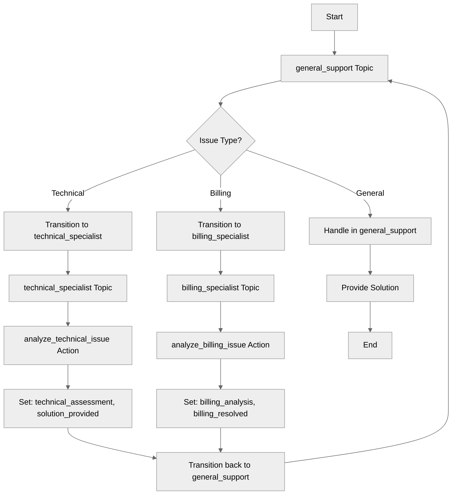

## Key Concepts

- **Specialist topics**: Topics with domain expertise
- **Consultation pattern**: Route to specialist, then return
- **Natural language routing**: Route based on user intent and topic descriptions
- **State transfer**: Variables shared across all topics
- **Return control**: Specialist transitions back to main topic

## How It Works

### Main Topic Routes to Specialists

The general support topic routes to specialists based on issue type:

```agentscript
topic general_support:
   description: "General customer support entry point"

   reasoning:
      instructions:->
         | I'm here to help! I can assist with:
           - Technical issues (I'll consult our tech specialist)
           - Billing questions (I'll consult our billing specialist)
           - General inquiries

           What can I help you with today?

      actions:
         consult_technical: @utils.transition to @topic.technical_specialist

         consult_billing: @utils.transition to @topic.billing_specialist
```

### Specialist Topic Processes and Returns

The specialist handles their domain, then returns control:

```agentscript
topic technical_specialist:
   description: "Technical support specialist - handles complex technical issues"

   actions:
      analyze_technical_issue:
         description: "Perform technical analysis"
         inputs:
            issue_description: string
               description: "Detailed description of the technical issue to analyze"
         outputs:
            assessment: string
               description: "Technical assessment and diagnosis of the issue"
            can_resolve: boolean
               description: "Indicates whether the issue can be resolved"
         target: "flow://AnalyzeTechnicalIssue"

   reasoning:
      instructions:->
         | Technical Specialist here! Let me analyze your issue.

           Issue: {!@variables.issue_description}

      actions:
         analyze_technical: @actions.analyze_technical_issue
            with issue_description=@variables.issue_description
            set @variables.technical_assessment = @outputs.assessment
            set @variables.solution_provided = @outputs.can_resolve
            # Return control to general support
            transition to @topic.general_support
```

### Billing Specialist

```agentscript
topic billing_specialist:
   description: "Billing specialist - handles billing and payment issues"

   actions:
      analyze_billing_issue:
         description: "Analyze billing inquiry"
         inputs:
            issue_description: string
               description: "Description of the billing issue or inquiry"
            customer_id: string
               description: "The unique identifier of the customer"
         outputs:
            analysis: string
               description: "Analysis of the billing issue"
            resolved: boolean
               description: "Indicates whether the billing issue was resolved"
         target: "flow://AnalyzeBillingIssue"

   reasoning:
      instructions:->
         | Billing Specialist here! Let me review your account.

           Customer ID: {!@variables.customer_id}
           Issue: {!@variables.issue_description}

      actions:
         analyze_billing: @actions.analyze_billing_issue
            with issue_description=@variables.issue_description
            with customer_id=@variables.customer_id
            set @variables.billing_analysis = @outputs.analysis
            set @variables.billing_resolved = @outputs.resolved
            # Return control to general support
            transition to @topic.general_support
```

## Key Code Snippets

### Variables for Tracking Issue State

```agentscript
variables:
   issue_type: mutable string = ""
   issue_description: mutable string = ""
   customer_id: mutable string = ""

   # Technical specialist results
   technical_assessment: mutable string = ""
   solution_provided: mutable boolean = False

   # Billing specialist results
   billing_analysis: mutable string = ""
   billing_resolved: mutable boolean = False
```

### Routing Based on Issue Type

```agentscript
actions:
   consult_technical: @utils.transition to @topic.technical_specialist

   consult_billing: @utils.transition to @topic.billing_specialist
```

### Specialist Returns with Results

```agentscript
actions:
   analyze_technical: @actions.analyze_technical_issue
      with issue_description=@variables.issue_description
      set @variables.technical_assessment = @outputs.assessment
      set @variables.solution_provided = @outputs.can_resolve
      transition to @topic.general_support
```

## Try It Out

### Example: Technical Issue Consultation

```text
Agent: [general_support topic]
       Welcome to Customer Support! How can I help you today?

User: My app keeps crashing when I try to upload files

Agent: [Sets issue_type = "technical", issue_description = "..."]
       Let me connect you with our technical specialist...

[Transitions to technical_specialist topic]

Agent: [technical_specialist topic]
       Technical Specialist here! Let me analyze your issue.

       Issue: App crashes during file upload

       [Runs analyze_technical_issue action]

       I found the issue - it appears to be a memory issue.
       Try to reboot the system.

[Transitions back to general_support]

Agent: [general_support topic]
       Great news! Our technical specialist identified the issue.

       Our technical specialist recommends trying to reboot your system as a first step.

       Does this help resolve your issue?
```

### Example: Billing Consultation

```text
User: I was charged twice for my subscription

Agent: [Sets issue_type = "billing"]
       Let me connect you with our billing specialist...

[Transitions to billing_specialist topic]

Agent: [billing_specialist topic]
       Billing Specialist here! Let me review your account.

       [Runs analyze_billing_issue action]

       I found the duplicate charge. I've initiated a refund
       of $29.99 which will appear in 3-5 business days.

[Transitions back to general_support]

Agent: [general_support topic]
       Our billing specialist has resolved your issue.

       A refund of $29.99 has been initiated.
       You should see it in 3-5 business days.

       Is there anything else I can help you with?
```

## Pattern Comparison

### Specialist Consultation (This Pattern)

- Route to specialist based on issue type
- Specialist processes and returns
- Use for: domain-specific expertise

### Direct Transition

- Move to new topic permanently
- No automatic return
- Use for: workflow stages (browse → book → confirm)

## Best Practices

✅ **Clear specialist roles** - Each handles specific domain

✅ **Return with results** - Store assessment in variables

✅ **Natural routing** - Use clear topic descriptions for routing

✅ **Share state** - Variables persist across topics

❌ **Don't over-specialize** - Keep simple tasks in main topic

❌ **Don't circular route** - Avoid specialist → specialist

## What's Next

- **MultiTopicOrchestration**: Build complex multi-service workflows
- **DynamicActionRouting**: More conditional action patterns
- **CustomerServiceAgent**: See a complete service agent example

## Testing

### Test Case 1: Technical Route

- Set issue_type = "technical"
- Verify transition to technical_specialist
- Confirm return to general_support

### Test Case 2: Billing Route

- Set issue_type = "billing"
- Verify transition to billing_specialist
- Confirm return to general_support

### Test Case 3: State Transfer

- Set issue_description in general_support
- Verify specialist has access
- Confirm results returned in variables

------------------------
# ErrorHandling

## Overview

This recipe demonstrates **comprehensive error handling and validation** patterns for building safe, reliable agents. Learn how to validate inputs, prevent dangerous operations, handle edge cases, and use conditional action availability for safety.

## Agent Flow

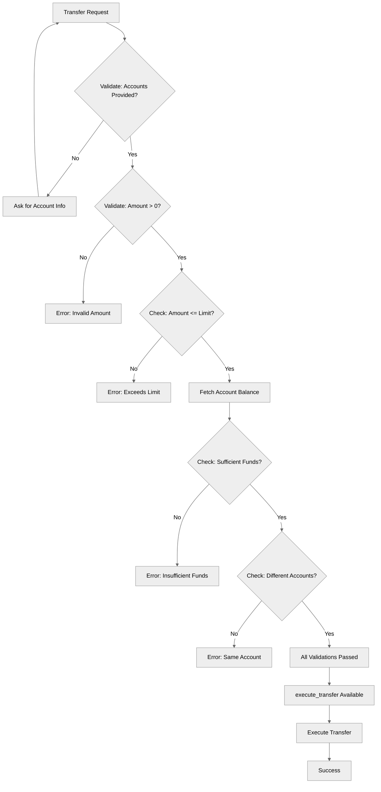

## Key Concepts

- **Input validation**: Checking data before processing
- **Business rule enforcement**: Enforcing limits and constraints
- **Guard clauses**: Preventing operations when preconditions aren't met
- **Error state tracking**: Using variables to track validation status
- **Conditional action availability**: Using `available when` for safety
- **Clear error messaging**: Guiding users when problems occur

## How It Works

### Validation-First Approach

Before performing critical operations, validate everything in procedural instructions:

```agentscript
instructions:->
   # Step 1: Check required information
   if not @variables.source_account:
      set @variables.validation_information = "Missing source account"
      set @variables.validation_passed = False
      | You need the source account number before proceeding.
        Ask the customer for the source account number.

   # Step 2: Check amount is valid
   if @variables.transfer_amount <= 0:
      set @variables.validation_information = "Invalid transfer amount"
      set @variables.validation_passed = False
      | The transfer amount must be greater than zero. Ask the customer
        how much they want to transfer.
        Do NOT proceed with the transfer yet.
```

### Enforcing Business Rules

```agentscript
instructions:->
   if @variables.transfer_amount > @variables.transfer_limit:
      set @variables.validation_information = "Amount exceeds transfer limit"
      set @variables.validation_passed = False
      | ⚠️ STOP: The requested amount (${!@variables.transfer_amount}) exceeds
        the maximum transfer limit of ${!@variables.transfer_limit}.
        Inform the customer and ask if they'd like to:
        1. Transfer the maximum allowed amount (${!@variables.transfer_limit})
        2. Split into multiple transfers
        3. Contact support for higher limits
        Do NOT proceed with the transfer.
```

### Fetching and Validating External Data

```agentscript
instructions:->
   # Fetch balance if needed
   if @variables.source_account and not @variables.source_balance:
      run @actions.get_account_balance
         with account_number = @variables.source_account
         set @variables.source_balance = @outputs.balance

   # Validate sufficient funds
   if @variables.source_balance < @variables.transfer_amount:
      set @variables.validation_information = "Insufficient funds"
      set @variables.validation_passed = False
      | ⚠️ STOP: Insufficient funds in the source account.
        - Available balance: ${!@variables.source_balance}
        - Requested transfer: ${!@variables.transfer_amount}
        - Shortfall: ${!@variables.transfer_amount-@variables.source_balance}
        Ask if they'd like to transfer a smaller amount.
        Do NOT proceed with the transfer.
```

### Preventing Logic Errors

```agentscript
instructions:->
   if @variables.source_account == @variables.destination_account:
      set @variables.validation_information = "Source and destination are the same"
      set @variables.validation_passed = False
      | ⚠️ STOP: You cannot transfer to the same account.
        The source and destination accounts are identical.
        Ask for the correct destination account.
        Do NOT proceed with the transfer.
```

### Conditional Action Availability

Only make dangerous actions available when safe:

```agentscript
actions:
   execute_transfer: @actions.execute_transfer
      available when @variables.validation_passed
      with from_account=@variables.source_account
      with to_account=@variables.destination_account
      with amount=@variables.transfer_amount
```

The action won't be available to the LLM unless `validation_passed = True`.

## Key Code Snippets

### Complete Validation Flow

```agentscript
reasoning:
   # Procedural instructions with error handling logic
   instructions:->
      | Always ensure to request the following data from the user, and to store it using {!@actions.store_details}
         - source account number
         - destination account number
         - amount to transfer

         Only after you have all the data, you can proceed with the next steps.

      if not @variables.source_account:
          set @variables.validation_information = "Missing source account"
          set @variables.validation_passed = False
          | You need the source account number before proceeding.
            Ask the customer for the source account number.
      else:
          set @variables.validation_passed = True
      if @variables.source_account and not @variables.destination_account:
         set @variables.validation_information = "Missing destination account"
         set @variables.validation_passed = False
         | You need the destination account number before proceeding.
            Ask the customer for the destination account number.
      else:
         set @variables.validation_passed = True
      if not @variables.source_account or not @variables.destination_account:
          | Do NOT proceed with the transfer yet.
      if @variables.transfer_amount <= 0:
          set @variables.validation_information = "Invalid transfer amount"
          set @variables.validation_passed = False
          | The transfer amount must be greater than zero. Ask the customer
            how much they want to transfer.
            Do NOT proceed with the transfer yet.
      else:
         set @variables.validation_passed = True
      if @variables.transfer_amount > @variables.transfer_limit:
         set @variables.validation_information = "Amount exceeds transfer limit"
         set @variables.validation_passed = False
         | ⚠️ STOP: The requested amount (${!@variables.transfer_amount}) exceeds
           the maximum transfer limit of ${!@variables.transfer_limit}.
           Inform the customer and ask if they'd like to:
           1. Transfer the maximum allowed amount (${!@variables.transfer_limit})
           2. Split into multiple transfers
           3. Contact support for higher limits
           Do NOT proceed with the transfer.
      else:
         set @variables.validation_passed = True
      if @variables.source_account and not @variables.source_balance:
         run @actions.get_account_balance
            with account_number = @variables.source_account
            set @variables.source_balance = @outputs.balance
      else:
         set @variables.validation_passed = True
      if @variables.source_balance < @variables.transfer_amount:
         set @variables.validation_information = "Insufficient funds"
         set @variables.validation_passed = False
         | ⚠️ STOP: Insufficient funds in the source account.
           - Available balance: ${!@variables.source_balance}
           - Requested transfer: ${!@variables.transfer_amount}
           - Shortfall: ${!@variables.transfer_amount-@variables.source_balance}
           Ask if they'd like to transfer a smaller amount.
           Do NOT proceed with the transfer.
      else:
         set @variables.validation_passed = True
      if @variables.source_account == @variables.destination_account:
         set @variables.validation_information = "Source and destination are the same"
         set @variables.validation_passed = False
         | ⚠️ STOP: You cannot transfer to the same account.
           The source and destination accounts are identical.
           Ask for the correct destination account.
           Do NOT proceed with the transfer.
      else:
         set @variables.validation_passed = True

      | In case the validation fails, return {!@variables.validation_information} to the user and do NOT proceed with the transfer.
        If {!@variables.validation_passed}, execute the transfer using {!@actions.execute_transfer}.

   actions:
      get_account_balance: @actions.get_account_balance
         with account_number=...
         set @variables.source_balance = @outputs.balance

      store_details: @utils.setVariables
         with source_account = ...
         with destination_account = ...
         with transfer_amount = ...

      # Only make this available if validation passed
      execute_transfer: @actions.execute_transfer
         available when @variables.validation_passed
         with from_account=@variables.source_account
         with to_account=@variables.destination_account
         with amount=@variables.transfer_amount
```

### Variables for Validation State

```agentscript
variables:
   source_account: mutable string = ""
      description: "Account to transfer from"

   destination_account: mutable string = ""
      description: "Account to transfer to"

   transfer_amount: mutable number = 0
      description: "Amount to transfer"

   source_balance: mutable number = 0
      description: "Balance of source account"

   transfer_limit: mutable number = 10000
      description: "Maximum allowed transfer amount"

   validation_passed: mutable boolean = False
      description: "Whether all validations passed"

   validation_information: mutable string = ""
      description: "Human readable validation information"
```

## Try It Out

### Example 1: Missing Information

```text
User: I want to transfer $500

Agent: I need the source account number before proceeding.
       Could you please provide the source account number?

[validation_passed = False, execute_transfer NOT available]
```

### Example 2: Exceeds Limit

```text
User: Transfer $15,000 from 1234567890 to 0987654321

[Validation: 15000 > 10000 limit]

Agent: ⚠️ STOP: The requested amount ($15,000) exceeds
       the maximum transfer limit of $10,000.
       Inform the customer and ask if they'd like to:
       1. Transfer the maximum allowed amount ($10,000)
       2. Split into multiple transfers
       3. Contact support for higher limits
       Do NOT proceed with the transfer.

[validation_passed = False]
```

### Example 3: Insufficient Funds

```text
User: Transfer $5,000 from 0987654321 to 1234567890

[Fetches balance: $200]
[Validation: 200 < 5000]

Agent: ⚠️ STOP: Insufficient funds in the source account.
       - Available balance: $200
       - Requested transfer: $5,000
       - Shortfall: $4,800
       Ask if they'd like to transfer a smaller amount.
       Do NOT proceed with the transfer.

[validation_passed = False]
```

### Example 4: All Validations Pass

```text
User: Transfer $500 from 1234567890 to 0987654321

[All validations pass]

Agent: Transferring $500 from 1234567890 to 0987654321...
       Transfer completed successfully!
       Transaction ID: TXN-789456

[execute_transfer executed automatically]
```

## Best Practices

### Clear Error Messages

**Good:**

```agentscript
| ⚠️ STOP: Insufficient funds.
  - Available: ${!@variables.source_balance}
  - Requested: ${!@variables.transfer_amount}
  - Short by: ${!@variables.transfer_amount - @variables.source_balance}
  Would you like to transfer ${!@variables.source_balance} instead?
```

**Poor:**

```agentscript
| Error: Invalid transfer
```

### Explicit Stop Instructions

**Good:**

```agentscript
| Do NOT proceed with the transfer.
```

**Poor:**

```agentscript
| There's a problem.
```

### Visual Indicators

Use emojis for quick recognition:

- ⚠️ for warnings/errors
- ✓ for successful checks
- 🛑 for critical stops

## What's Next

- **SafetyAndGuardrails**: More advanced safety patterns
- **MultiStepWorkflows**: Handle errors across action chains
- **CustomerServiceAgent**: See validation in a complete agent

## Testing

### Test Case 1: Happy Path

- All fields valid, within limits, sufficient funds
- Expected: validation_passed = True, action available

### Test Case 2: Missing Source Account

- source_account = ""
- Expected: Error message, validation_passed = False

### Test Case 3: Amount Exceeds Limit

- amount = 15000, limit = 10000
- Expected: Exceeds limit error, options provided

### Test Case 4: Insufficient Funds

- amount = 5000, balance = 3500
- Expected: Insufficient funds error, suggest lower amount

### Test Case 5: Same Account

- source = 12345, destination = 12345
- Expected: Same account error

### Test Case 6: Action Availability

- validation_passed = False
- Expected: execute_transfer NOT shown to LLM

----------------------------
# ExternalAPIIntegration

## Overview

Learn how to integrate **external APIs and systems** using Flow and Apex targets. This recipe demonstrates patterns for calling weather APIs, payment gateways, and shipping trackers.

## Agent Flow

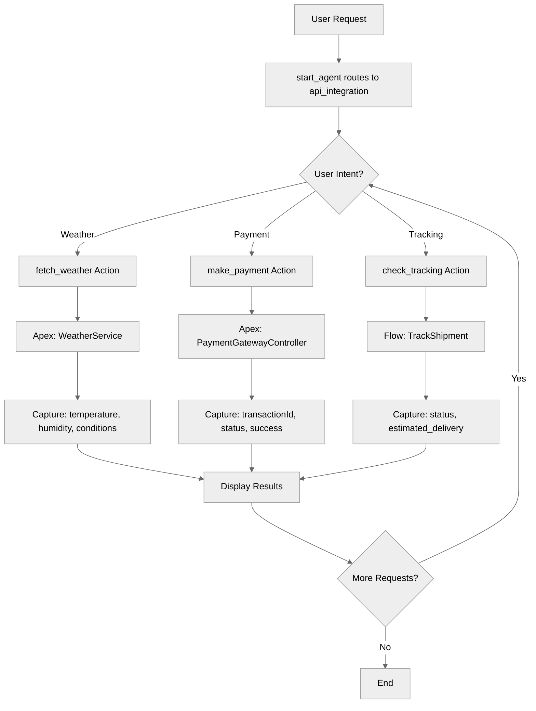

## Key Concepts

- **Flow targets (`flow://`)**: Call external APIs via Salesforce Flows
- **Apex targets (`apex://`)**: Call external APIs via Apex classes
- **API response handling**: Capture outputs from external calls
- **Error tracking**: Monitor API success/failure status
- **Multiple integrations**: Different services, different targets

## How It Works

### Apex-Based Integration (Weather)

```agentscript
actions:
   get_weather:
      description: "Fetch weather data from external API via Flow"
      inputs:
         cityName: string
      outputs:
         temperature: number
         conditions: string
         humidity: number
         success: boolean
         error_message: string
      target: "apex://WeatherService"
```

### Apex-Based Integration (Payment)

```agentscript
actions:
   process_payment:
      description: "Process payment via external payment gateway using Apex"
      inputs:
         amount: number
         paymentToken: string
         currencyName: string
      outputs:
         transactionId: string
         status: string
         success: boolean
         errorMessage: string
      target: "apex://PaymentGatewayController"
```

### Flow-Based Integration (Shipping)

```agentscript
actions:
   track_shipment:
      description: "Track shipment via external shipping API"
      inputs:
         tracking_number: string
         carrier: string
      outputs:
         status: object
         estimated_delivery: string
         success: boolean
      target: "flow://TrackShipment"
```

### Using Actions in Reasoning

```agentscript
reasoning:
   instructions:->
      | Identify the action based on the user's request. You can:
        - Get weather
        - Process payment
        - Track shipment

      | If an action needs user input, prompt the user for the needed info before
        performing the action. For example:
        - Weather: need city name
        - Payment: need amount and payment token
        - Shipping: need tracking number

   actions:
      fetch_weather: @actions.get_weather
         with cityName= ...
         set @variables.temperature = @outputs.temperature
         set @variables.humidity = @outputs.humidity
         set @variables.conditions = @outputs.conditions
         set @variables.api_response_status = ""
         set @variables.api_error_message = ""

      make_payment: @actions.process_payment
         with amount=...
         with paymentToken=...
         with currencyName="USD"
         set @variables.transaction_id = @outputs.transactionId
         set @variables.api_response_status = @outputs.success
         set @variables.api_error_message = @outputs.errorMessage

      check_tracking: @actions.track_shipment
         with tracking_number=...
         with carrier="USPS"
         set @variables.shipment_status = @outputs.status
         set @variables.api_response_status = @outputs.success
```

## Key Code Snippets

### Variables for API State

```agentscript
variables:
   # API tracking
   api_request_id: mutable string = ""
   api_response_status: mutable string = ""
   api_error_message: mutable string = ""

   # Weather API example
   temperature: mutable string = ""
   humidity: mutable string = ""
   conditions: mutable string = ""

   # Payment API example
   transaction_id: mutable string = ""

   # Shipping API example
   shipment_status: mutable object = {}
```

### Complete Action Definitions

```agentscript
actions:
   get_weather:
      description: "Fetch weather data from external API via Flow"
      inputs:
         cityName: string
      outputs:
         temperature: number
         conditions: string
         humidity: number
         success: boolean
         error_message: string
      target: "apex://WeatherService"

   process_payment:
      description: "Process payment via external payment gateway using Apex"
      inputs:
         amount: number
         paymentToken: string
         currencyName: string
      outputs:
         transactionId: string
         status: string
         success: boolean
         errorMessage: string
      target: "apex://PaymentGatewayController"

   track_shipment:
      description: "Track shipment via external shipping API"
      inputs:
         tracking_number: string
         carrier: string
      outputs:
         status: object
         estimated_delivery: string
         success: boolean
      target: "flow://TrackShipment"
```

## Try It Out

### Example: Weather Lookup

```text
Agent: I can integrate with external APIs for weather, payments, and shipping!

User: What's the weather in San Francisco?

[Agent calls get_weather via Apex]
  - WeatherService.getWeather("San Francisco")
  - Returns: temperature=65, conditions="Partly Cloudy", humidity=72

Agent: Weather in San Francisco:
       🌤️ Partly Cloudy
       Temperature: 65°F
       Humidity: 72%
```

### Example: Payment Processing

```text
User: Process a payment of $50

Agent: I'll need a payment token to process this. Do you have one?

User: Yes, the token is PAY-TOKEN-123

[Agent calls process_payment via Apex]
  - PaymentGatewayController.process(50, "PAY-TOKEN-123", "USD")
  - Returns: transactionId="TXN-789", status="approved", success=true

Agent: ✅ Payment processed successfully!

       Transaction ID: TXN-789
       Amount: $50.00
       Status: Approved
```

### Example: Shipment Tracking

```text
User: Track my shipment 1Z999AA10123456784

[Agent calls track_shipment via Flow]
  - TrackShipment flow with tracking_number and carrier="USPS"
  - Returns: status object, estimated_delivery="2025-01-22"

Agent: 📦 Shipment Status:

       Tracking: 1Z999AA10123456784
       Status: In Transit
       Estimated Delivery: January 22, 2025
```

## Integration Patterns

### Pattern 1: Simple API Call

```agentscript
fetch_data: @actions.api_call
   with param=...
   set @variables.result = @outputs.data
```

### Pattern 2: With Error Capture

```agentscript
fetch_data: @actions.api_call
   with param=...
   set @variables.result = @outputs.data
   set @variables.success = @outputs.success
   set @variables.error = @outputs.error_message
```

### Pattern 3: Fixed Default Parameters

```agentscript
make_payment: @actions.process_payment
   with amount=...
   with paymentToken=...
   with currencyName="USD"  # Fixed default
```

## Best Practices

✅ **Always capture success status** - Check if API call succeeded

✅ **Store error messages** - For user feedback

✅ **Use appropriate targets** - Flow for simple, Apex for complex

✅ **Prompt for required inputs** - Don't call APIs without needed data

❌ **Don't assume success** - Always verify response

❌ **Don't expose raw errors** - Show user-friendly messages

## What's Next

- **ErrorHandling**: Build robust error handling
- **MultiStepWorkflows**: Chain multiple API calls
- **ActionCallbacks**: Process API results

## Testing

### Test Case 1: Successful API Call

- Provide valid inputs
- Verify API called correctly
- Check outputs captured

### Test Case 2: API Error

- Trigger API failure
- Verify error captured
- Check graceful handling

### Test Case 3: Missing Input

- Don't provide required input
- Verify agent prompts for it

--------------------------
# MultiStepWorkflows

## Overview

This recipe demonstrates how to orchestrate **multi-step workflows** where actions are chained together in sequence. Learn how to build onboarding processes with multiple steps, pass data between actions, and track progress through boolean state flags.

## Agent Flow

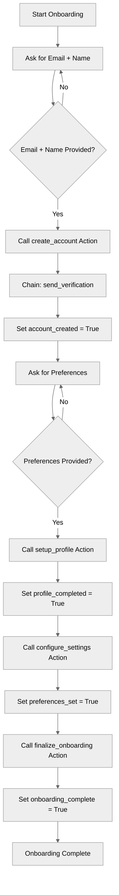

## Key Concepts

- **Action chaining**: Using `run` to execute follow-up actions automatically
- **Step-by-step workflows**: Guided multi-step processes with clear progression
- **Progress tracking**: Boolean flags to track completion of each step
- **Data flow**: Outputs from one action feed into subsequent actions
- **Procedural instructions**: Step-by-step rules that guide the LLM through the workflow

## How It Works

### Workflow State Variables

Track progress with boolean flags and store data needed across steps:

```agentscript
variables:
   customer_email: mutable string = ""
   customer_id: mutable string = ""
   account_created: mutable boolean = False
   profile_completed: mutable boolean = False
   preferences_set: mutable boolean = False
   onboarding_complete: mutable boolean = False
   verification_token: mutable string = ""
   step: mutable number = 0
```

### Step-by-Step Instructions

Use procedural instructions to guide the workflow through each step:

```agentscript
reasoning:
   instructions: ->
      | Follow the below Rules step by step
        Rules:
        Step 1:
           First step is to create Account with the name and customer email
           If not provided you will ask for it and you won't proceed.
           After Step 1 please proceed to Step 2
        Step 2:
           Before setting up the customer's profile,
           Ask the customer about their preferences:
              1. Notification preferences (email, SMS, or both)
              2. Preferred language
              3. Timezone
           Collect all this info and call it 'preferences'.
        Only proceed with setup_profile action after you have preferences.
        After Step 2 please proceed to Step 3
        Step 3:
           Before configuring account settings, ask the customer about:
              1. Default notification settings
              2. Privacy preferences
           Collect all this info and call it 'settings'.
        Only proceed with configure_settings action after you have settings.
        After Step 3 please proceed to Step 4
        Step 4:
           This is the final action.
           Execute finalize_onboarding
           Tell customer they have completed onboarding successfully
```

### Action with Chained Follow-up

The `run` keyword chains a follow-up action immediately after the primary action completes:

```agentscript
actions:
   create_account: @actions.create_account
      with email = ...
      with name = ...
      set @variables.customer_id = @outputs.customer_id
      set @variables.account_created = @outputs.success
      set @variables.customer_email = @outputs.customer_email
      # Chain a follow-up action
      run @actions.send_verification
         with customer_id = @variables.customer_id
         with email = @variables.customer_email
         set @variables.verification_token = @outputs.token
```

## Key Code Snippets

### Action Definitions

```agentscript
actions:
   create_account:
      description: "Creates a new customer account"
      inputs:
         email: string
            description: "Customer's email address"
         name: string
            description: "Customer's full name"
      outputs:
         customer_id: string
            description: "Unique identifier for the new account"
         success: boolean
            description: "Whether account was created"
         customer_email: string
            description: "Customer email"
      target: "flow://CreateCustomerAccount"

   send_verification:
      description: "Sends email verification"
      inputs:
         customer_id: string
            description: "Customer to send verification to"
         email: string
            description: "Email address for verification"
      outputs:
         token: string
            description: "Verification token"
         sent: boolean
            description: "Whether email was sent"
      target: "flow://SendVerificationEmail"

   setup_profile:
      description: "Creates customer profile with preferences"
      inputs:
         customer_id: string
            description: "Customer to set up profile for"
         preferences: string
            description: "Customer preferences"
      outputs:
         profile_id: string
            description: "Profile identifier"
         success: boolean
            description: "Whether profile was created"
      target: "flow://SetupCustomerProfile"

   configure_settings:
      description: "Sets default account settings"
      inputs:
         customer_id: string
            description: "Customer to configure"
         settings: string
            description: "Account settings"
      outputs:
         success: boolean
            description: "Whether settings were configured"
      target: "flow://ConfigureAccountSettings"

   finalize_onboarding:
      description: "Marks onboarding as complete and sends welcome email"
      inputs:
         customer_id: string
            description: "Customer to finalize"
      outputs:
         success: boolean
            description: "Whether onboarding was finalized"
         welcome_sent: boolean
            description: "Whether welcome email was sent"
      target: "flow://FinalizeOnboarding"
```

### Reasoning Actions

```agentscript
actions:
   create_account: @actions.create_account
      with email = ...
      with name = ...
      set @variables.customer_id = @outputs.customer_id
      set @variables.account_created = @outputs.success
      set @variables.customer_email = @outputs.customer_email
      run @actions.send_verification
         with customer_id = @variables.customer_id
         with email = @variables.customer_email
         set @variables.verification_token = @outputs.token

   setup_profile: @actions.setup_profile
      with customer_id = ...
      with preferences = ...
      set @variables.profile_completed = @outputs.success

   configure_settings: @actions.configure_settings
      with customer_id = ...
      with settings = ...
      set @variables.preferences_set = @outputs.success

   finalize_onboarding: @actions.finalize_onboarding
      with customer_id = ...
      set @variables.onboarding_complete = @outputs.success
```

## Try It Out

### Example Interaction

```text
Agent: Welcome! Let's get you onboarded step by step to our platform. I'll guide you
       through the process. Please provide your email and name to begin the onboarding
       process.

User: john.smith@gmail.com, John Smith

Agent: Step 1 of 4: Account Creation

       Your account is being created with the following details:
       Name: John Smith
       Email: john.smith@gmail.com

       Step 1 is complete!

       Step 2 of 4: Please share any preferences you have (for example, communication
       preferences, interests, or anything you'd like us to know to personalize your
       experience).

User: communication preferences - keep everything private
      No other preference

Agent: Step 2 of 4: Preferences Set

       Your communication preference has been noted: everything will be kept private.

       Step 3 of 4: Your privacy settings are now configured to "all private" for
       maximum confidentiality.

       Step 4 of 4: Onboarding is complete! A welcome message has been sent to your
       email.

       You are all set. If you have any questions or need further assistance, feel
       free to ask!
```

### Behind the Scenes

1. **Step 1**: Agent calls `create_account` with email and name, then chains `send_verification`
2. **Step 2**: Agent calls `setup_profile` with collected preferences
3. **Step 3**: Agent calls `configure_settings` with privacy settings
4. **Step 4**: Agent calls `finalize_onboarding` to complete the process

## Workflow Patterns

### Linear Workflow

Steps execute in a fixed order:

```text
Step 1 → Step 2 → Step 3 → Step 4 → Complete
```

### Action Chaining with `run`

Execute a follow-up action immediately after the primary action:

```agentscript
primary: @actions.primary_action
   with input = ...
   set @variables.result = @outputs.value
   run @actions.follow_up
      with data = @variables.result
```

**Note**: Only one level of nesting is allowed for chained actions.

## Best Practices

- **Track State Clearly**: Use descriptive boolean flags like `account_created` and `profile_completed`
- **Provide Progress Feedback**: Show users which step they're on (e.g., "Step 2 of 4")
- **Validate Before Each Step**: Ensure required data is collected before calling actions
- **Handle Partial Completion**: Allow users to resume where they left off

## What's Next

- **ActionCallbacks**: Learn more about the `run` keyword for chaining actions
- **MultiTopicOrchestration**: Split complex workflows across multiple topics
- **ErrorHandling**: Handle step failures gracefully

## Testing

### Test Case 1: Complete Happy Path

- Execute all 4 steps in sequence
- Verify state updates correctly at each step
- Confirm final completion message

### Test Case 2: Resume from Step 2

- Set `account_created=True` and `customer_id="..."`
- Start conversation
- Agent should continue at step 2

### Test Case 3: Data Flow Verification

- Verify `customer_id` from step 1 is used in steps 2-4
- Confirm all state persists across the conversation
----------------------------
# MultiTopicNavigation

## Overview

This recipe demonstrates how to build agents with **multiple topics** and navigate between them. Topics allow you to organize complex agents into specialized conversation modes, each handling a specific phase or capability of the interaction.

## Agent Flow

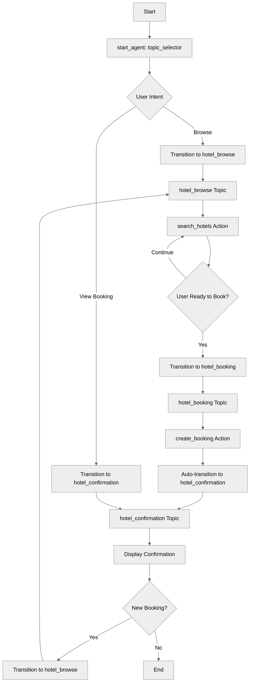

## Key Concepts

- **Multiple topic blocks**: Defining several topics in one agent
- **Topic transitions**: Moving between topics with `@utils.transition to @topic.name`
- **Transition after action**: Using `transition to` in action blocks
- **Topic specialization**: Each topic handles a specific responsibility
- **State sharing**: Variables are global across all topics
- **Conditional transitions**: Using `available when` on transition actions

## How It Works

### Multi-Topic Architecture

Instead of one topic handling everything, create specialized topics:

```agentscript
start_agent topic_selector:
   description: "Welcome users and determine their hotel service needs"

   reasoning:
      actions:
         browse_hotels: @utils.transition to @topic.hotel_browse
            description: "Browse and search for available hotels"

         view_booking: @utils.transition to @topic.hotel_confirmation
            description: "View existing booking confirmations"
            available when @variables.booking_confirmed == True

topic hotel_browse:
   description: "Browse available hotels and view information"

topic hotel_booking:
   description: "Handle hotel booking and reservation"

topic hotel_confirmation:
   description: "Confirm booking and provide details"
```

### Topic Transitions with @utils.transition

Move between topics using `@utils.transition to @topic.name`:

```agentscript
reasoning:
   actions:
      browse_hotels: @utils.transition to @topic.hotel_browse
         description: "Browse and search for available hotels"
```

### Conditional Transition Availability

Use `available when` to control when transitions are possible:

```agentscript
actions:
   view_booking: @utils.transition to @topic.hotel_confirmation
      description: "View existing booking confirmations"
      available when @variables.booking_confirmed == True
```

### Automatic Transition After Action

Transition after an action completes using `transition to`:

```agentscript
actions:
   create_booking: @actions.create_booking
      with hotel_name=...
      with check_in=...
      with check_out=...
      set @variables.booking_id = @outputs.booking_id
      set @variables.booking_confirmed = @outputs.success
      transition to @topic.hotel_confirmation
```

## Key Code Snippets

### Complete Topic: Hotel Browse

```agentscript
topic hotel_browse:
   description: "Browse available hotels and view information"

   actions:
      search_hotels:
         description: "Search for available hotels"
         inputs:
            location: string
               description: "City or location to search for hotels in"
            check_in: string
               description: "Check-in date in ISO format (YYYY-MM-DD)"
            check_out: string
               description: "Check-out date in ISO format (YYYY-MM-DD)"
         outputs:
            hotels: list[object]
               description: "List of available hotel objects with name, price, rating, and amenities information"
               complex_data_type_name: "lightning__recordInfoType" # This is the name of the complex data type that is used to store the hotel objects
         target: "flow://SearchHotels"

   reasoning:
      instructions:->
         | Help users find the perfect hotel using {!@actions.search_hotels}.

           Ensure to ask the user for:
           - location
           - check-in date
           - check-out date

           Do not ask for other booking details.

           If you find available hotels provide the user the hotel information.

      actions:
         search_hotels: @actions.search_hotels
            with location=...
            with check_in=...
            with check_out=...
            transition to @topic.hotel_booking
```

### Complete Topic: Hotel Booking

```agentscript
topic hotel_booking:
   description: "Handle hotel booking and reservation"

   actions:
      create_booking:
         description: "Creates a hotel reservation"
         inputs:
            hotel_name: string
               description: "Name of the hotel to book"
            check_in: string
               description: "Check-in date in ISO format (YYYY-MM-DD)"
            check_out: string
               description: "Check-out date in ISO format (YYYY-MM-DD)"
         outputs:
            booking_id: string
               description: "Unique booking confirmation identifier"
            success: boolean
               description: "Indicates whether the booking was created successfully"
         target: "flow://CreateBooking"

   reasoning:
      instructions:->
         | Complete the booking for the customer using {!@actions.create_booking}.

      actions:
         create_booking: @actions.create_booking
            with hotel_name=...
            with check_in=...
            with check_out=...
            set @variables.booking_id = @outputs.booking_id
            set @variables.booking_confirmed = @outputs.success
            transition to @topic.hotel_confirmation
```

### Complete Topic: Hotel Confirmation

```agentscript
topic hotel_confirmation:
   description: "Confirm booking and provide details"

   reasoning:
      instructions:->
         | The booking has been confirmed!

           Confirmation details:
           - Booking ID: {!@variables.booking_id}
           - Hotel: {!@variables.hotel_name}
           - Check-in: {!@variables.check_in_date}
           - Check-out: {!@variables.check_out_date}

           Provide these details to the customer and ask if they need anything else.
           If they want to make another booking, use start_new_booking action.

      actions:
         start_new_booking: @utils.transition to @topic.hotel_browse
            description: "Start a new hotel search and booking"
```

## Try It Out

### Example: Complete Booking Flow

**start_agent routes to hotel_browse**

```text
Agent: Welcome to our hotel booking service! I can help you browse hotels, make bookings, or answer questions.

User: I need a hotel in San Francisco for March 15-17

[Agent calls search_hotels action]
[Stores: check_in_date="2025-03-15", check_out_date="2025-03-17"]

Agent: I found several hotels in San Francisco for March 15-17:
       1. Bay View Hotel - $180/night
       2. Downtown Plaza - $150/night
       3. Airport Inn - $100/night

       Which one interests you?

User: I'll take the Bay View Hotel

Agent: Excellent choice! Let me help you book the Bay View Hotel.
```

**[Agent calls search_hotels action → transitions to hotel_booking]**

```text
Agent: I'm ready to complete your booking at Bay View Hotel.
       - Check-in: March 15
       - Check-out: March 17

       Please confirm these details are correct.

User: Yes, that's correct

[Agent calls create_booking action]
[Stores: hotel_name="Bay View Hotel", booking_id="BK789456"]
[Auto-transitions to hotel_confirmation]
```

**[Now in hotel_confirmation topic]**

```text
Agent: Your booking is confirmed! 🎉

       Confirmation details:
       - Booking ID: BK789456
       - Hotel: Bay View Hotel
       - Check-in: March 15
       - Check-out: March 17

       You'll receive a confirmation email shortly.
       Would you like to make another booking?

User: No, that's all. Thanks!

Agent: You're welcome! Have a wonderful stay!
```

## Multi-Topic Design Patterns

### Linear Workflow

```text
browse → booking → confirmation
```

Good for: Checkout processes, onboarding, step-by-step wizards

### Hub-and-Spoke

```text
main_menu → { product_info, order_status, support }
         ↓
      main_menu (return)
```

Good for: Customer service, multi-purpose assistants

### Bidirectional Flow

```text
browse ↔ booking ↔ confirmation
```

Good for: Exploratory interfaces, comparison shopping

## Best Practices

### Topic Naming

**Good:** `hotel_browse`, `payment_processing`, `account_settings`

**Poor:** `topic1`, `main`, `do_stuff`

### Transition Descriptions

**Good:**

```agentscript
start_new_booking: @utils.transition to @topic.hotel_browse
   description: "Start a new hotel search and booking"
```

**Poor:**

```agentscript
go_next: @utils.transition to @topic.next
   description: "Go next"
```

## What's Next

- **TopicDelegation**: Learn about delegation (consulting other topics)
- **MultiTopicOrchestration**: Handle complex workflows with 4+ topics
- **SystemInstructionOverrides**: Customize behavior per topic
- **DynamicActionRouting**: Control action availability

## Testing

### Test Case 1: Happy Path

- Start in browse → search → select → book → confirm
- Verify all transitions work

### Test Case 2: State Persistence

- Set check_in_date in browse
- Transition to booking
- Verify date still accessible

### Test Case 3: Multiple Bookings

- Complete one booking
- Use start_new_booking
- Complete second booking
- ---------------------
# SimpleQA

## Overview

This recipe demonstrates how to build a focused **question-and-answer agent**. It shows the pattern for single-topic agents that handle one specific type of interaction - in this case, answering product questions with the ability to look up real product information.

## Agent Flow

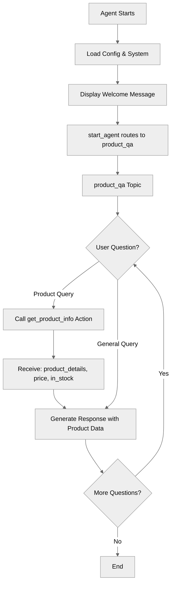

## Key Concepts

- **Single-topic agent pattern**: When one topic is sufficient for your use case
- **Focused agent design**: Building agents with a clear, limited scope
- **System vs. reasoning instructions**: Separating personality from task-specific guidance
- **Action integration**: Using external tools to fetch real data
- **start_agent routing**: Entry point that transitions to main topic

## How It Works

### Single-Topic Pattern

Unlike complex agents with multiple topics, many use cases work perfectly with just one topic:

```agentscript
start_agent topic_selector:
   description: "Welcome users and begin answering their product questions"

   reasoning:
      instructions:|
         Select the tool that best matches the user's message and conversation history. If it's unclear, make your best guess.
      actions:
         start_qa: @utils.transition to @topic.product_qa
            description: "Begin product question and answer session"

topic product_qa:
   description: "Answers questions about products, features, pricing, and availability"
```

This pattern works well when:

- The agent has one clear purpose
- All conversations follow a similar structure
- You don't need to transition between different modes

### System Instructions (Personality)

```agentscript
system:
   messages:
      welcome: "Hi! I'm here to answer your questions about our products and services. What would you like to know?"
      error: "I apologize, but I encountered an issue. Please try asking your question again."

   instructions: "You are a knowledgeable product specialist who helps customers understand products and services. Be clear, concise, and helpful. If you don't know something, admit it honestly."
```

System instructions define:

- **Who** the agent is (personality, role)
- **How** it should communicate (tone, style)
- **General principles** it should follow

### Reasoning Instructions (Task-Specific)

```agentscript
reasoning:
   instructions:->
      | Answer the user's questions about products and services clearly and accurately.
        When the user asks about a specific product, use the get_product_info action
        to look up current information.

        When answering:
        - Be specific and provide helpful details
        - If the question is unclear, ask for clarification
        - Stay focused on product-related topics
        - Use get_product_info to get accurate, up-to-date information

        Topics you can help with:
        - Product features and specifications
        - Pricing and packages
        - Availability and delivery
        - Comparisons between products
```

### Action for Data Lookup

```agentscript
actions:
   get_product_info:
      description: "Look up detailed information about a specific product"
      inputs:
         product_name: string
            description: "Name of the product to look up information for"
      outputs:
         product_details: string
            description: "Detailed product information including features, specifications, and description"
         price: number
            description: "Current price of the product"
         in_stock: boolean
            description: "Indicates whether the product is currently in stock and available"
      target: "flow://GetProductInfo"
```

## Key Code Snippets

### Complete Topic Structure

```agentscript
topic product_qa:
   description: "Answers questions about products, features, pricing, and availability"

   actions:
      get_product_info:
         description: "Look up detailed information about a specific product"
         inputs:
            product_name: string
               description: "Name of the product to look up information for"
         outputs:
            product_details: string
               description: "Detailed product information"
            price: number
               description: "Current price of the product"
            in_stock: boolean
               description: "Whether the product is in stock"
         target: "flow://GetProductInfo"

   reasoning:
      instructions:->
         | Answer the user's questions about products and services clearly and accurately.
           When the user asks about a specific product, use the get_product_info action
           to look up current information.

           When answering:
           - Be specific and provide helpful details
           - If the question is unclear, ask for clarification
           - Stay focused on product-related topics
           - Use get_product_info to get accurate, up-to-date information

           Topics you can help with:
           - Product features and specifications
           - Pricing and packages
           - Availability and delivery
           - Comparisons between products

      actions:
         get_product_info: @actions.get_product_info
            with product_name=...
```

### Making Action Available to LLM

```agentscript
reasoning:
   actions:
      get_product_info: @actions.get_product_info
         with product_name=...
```

The `...` means the LLM will extract the product name from the user's question.

## Try It Out

### Example Interaction 1: Product Query

```text
Agent: Hi! I'm here to answer your questions about our products and services. What would you like to know?

User: What features does Product Laptop X200 include?

[Agent calls get_product_info with product_name="Product X"]
[Returns: product_details="...", price=299, in_stock=true]

Agent: Product X includes several great features:
       - Feature A: [description]
       - Feature B: [description]
       - Feature C: [description]

       It's currently priced at $299 and is in stock. Would you like to know more about any specific feature?
```

### Example Interaction 2: Pricing Question

```text
User: How much does the wireless mouse cost?

[Agent calls get_product_info with product_name="Product Y"]
[Returns: price=149, in_stock=true]

Agent: Product Y is priced at $149 and is currently in stock.
       Would you like to know about its features or compare it to other products?
```

### Example Interaction 3: Availability Check

```text
User: Is the wireless mouse available?

[Agent calls get_product_info with product_name="Premium Widget"]
[Returns: in_stock=false]

Agent: I'm sorry, the Premium Widget is currently out of stock.
       Would you like me to let you know when it's available, or can I suggest some similar products?
```

## Design Tips

### Writing Effective Instructions

**Good instructions are:**

- **Specific**: "Use get_product_info to look up current information"
- **Actionable**: Clear guidance on when to use tools
- **Structured**: Use bullet points and sections

**Poor instructions:**

- Too vague: "Be helpful"
- Missing tool guidance: Doesn't explain when to call actions

### Single-Topic vs. Multi-Topic

Use single-topic when:

- The agent has one clear job
- Conversations don't need different "modes"
- All interactions follow similar patterns

Use multi-topic when:

- Different phases require different capabilities
- You need to hand off between specialized behaviors
- Complex workflows with distinct stages

## What's Next

This agent answers questions and can look up real product data. To add more capabilities:

- **VariableManagement**: Store user preferences or conversation state
- **MultiTopicNavigation**: Route to different specialists (sales, support, etc.)
- **ActionCallbacks**: Chain actions for complex lookups
- **TemplateExpressions**: Build dynamic responses with product data

## Testing

### Test Case 1: Product Info Lookup

- Ask about a specific product
- Verify get_product_info is called
- Check response includes details, price, availability

### Test Case 2: Unclear Question

- Ask "How much does it cost?" (no product specified)
- Verify agent asks for clarification

### Test Case 3: Out of Scope

- Ask about unrelated topic
- Verify agent stays focused on products
